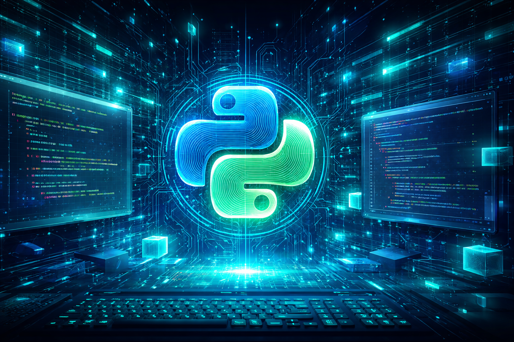

# Python - More Data Structures: Set, Dictionary

## Description
This project focuses on practicing **Python data structures** beyond lists and tuples, especially:
- **Sets** (unique elements, set operations)
- **Dictionaries** (key/value pairs, iteration, updates)
- **Lambda functions** and functional tools like **map**, **filter**, and **reduce**

All tasks are part of the repository **holbertonschool-higher_level_programming**, inside the folder:
`python-more_data_structures`.

---

## Learning Objectives
By the end of this project, you should be able to explain:
- Why Python programming is awesome
- What **sets** are, how to use them, and their common methods
- When to use **sets vs lists**
- How to iterate over a set
- What **dictionaries** are, how to use them, and when to use them vs lists/sets
- What a **key** is in a dictionary
- How to iterate over a dictionary
- What a **lambda** function is
- What **map**, **filter**, and **reduce** do (and when to use them)

---

## Resources
Read or watch:
- Data structures
- Lambda, filter, reduce and map
- Learn to Program 12 Lambda Map Filter Reduce

Useful commands:
- `man python3`
- `help()` in Python

---

## Requirements
- Allowed editors: `vi`, `vim`, `emacs`
- OS: Ubuntu 20.04 LTS
- Python version: `python3` (3.8.5)
- All files must end with a new line
- First line of all files: `#!/usr/bin/python3`
- `README.md` is mandatory at the root of the project directory
- Code style: `pycodestyle` (version 2.7.\*)
- All files must be executable
- File length will be checked using `wc`
- No importing modules (unless explicitly allowed in a task)

---

## Project Files & Tasks

### 0. Squared simple
**File:** `0-square_matrix_simple.py`  
**Prototype:** `def square_matrix_simple(matrix=[]):`  
Creates a **new matrix** where each integer is squared (original matrix unchanged).

---

### 1. Search and replace
**File:** `1-search_replace.py`  
**Prototype:** `def search_replace(my_list, search, replace):`  
Returns a **new list** where all occurrences of `search` are replaced by `replace`.

---

### 2. Unique addition
**File:** `2-uniq_add.py`  
**Prototype:** `def uniq_add(my_list=[]):`  
Adds **each unique integer only once** and returns the total sum.

---

### 3. Present in both
**File:** `3-common_elements.py`  
**Prototype:** `def common_elements(set_1, set_2):`  
Returns a set of elements **present in both** sets.

---

### 4. Only differents
**File:** `4-only_diff_elements.py`  
**Prototype:** `def only_diff_elements(set_1, set_2):`  
Returns a set of elements present in **only one** of the sets.

---

### 5. Number of keys
**File:** `5-number_keys.py`  
**Prototype:** `def number_keys(a_dictionary):`  
Returns the **number of keys** in a dictionary.

---

### 6. Print sorted dictionary
**File:** `6-print_sorted_dictionary.py`  
**Prototype:** `def print_sorted_dictionary(a_dictionary):`  
Prints the dictionary with keys sorted **alphabetically** (first level only).

---

### 7. Update dictionary
**File:** `7-update_dictionary.py`  
**Prototype:** `def update_dictionary(a_dictionary, key, value):`  
Replaces or adds a key/value in a dictionary and returns the updated dictionary.

---

### 8. Simple delete by key
**File:** `8-simple_delete.py`  
**Prototype:** `def simple_delete(a_dictionary, key=""):`  
Deletes a key from a dictionary if it exists (otherwise no change).

---

### 9. Multiply by 2
**File:** `9-multiply_by_2.py`  
**Prototype:** `def multiply_by_2(a_dictionary):`  
Returns a **new dictionary** with all integer values multiplied by 2.

---

### 10. Best score
**File:** `10-best_score.py`  
**Prototype:** `def best_score(a_dictionary):`  
Returns the key with the **highest integer value**. Returns `None` if input is `None` or empty.

---

### 11. Multiply by using map
**File:** `11-multiply_list_map.py`  
**Prototype:** `def multiply_list_map(my_list=[], number=0):`  
Returns a new list with all values multiplied by `number`, **without loops**, using `map`.  
Constraint: file must be **max 3 lines**.

---

### 12. Roman to Integer
**File:** `12-roman_to_int.py`  
**Prototype:** `def roman_to_int(roman_string):`  
Converts a Roman numeral string to an integer.
- Assumes range: **1 to 3999**
- If `roman_string` is not a string or is `None`, return `0`

---

## Usage
### Example (task 0):
```
./0-main.py
```

### General run pattern:
```
./<task>-main.py
```

---

## Author

**Gwenaelle PICHOT**  
Student at Holberton School  
Track: Higher Level Programming  
Project: Python - More Data Structures

