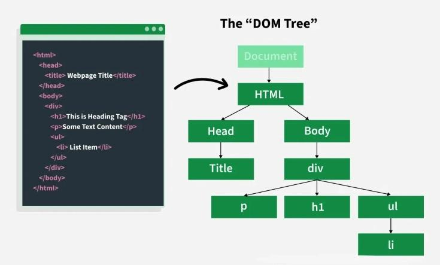

<p align="center">
  
</p>

# JavaScript - DOM Manipulation

> Making web pages interactive — because a static page is just a very slow PDF.

---

## 📝 Description

This project takes JavaScript beyond the terminal and into the browser. I learn how to select and manipulate HTML elements using the DOM API, respond to user events, dynamically update page content without reloading, and fetch data from external APIs using both XMLHttpRequest and the modern Fetch API. The result is a set of scripts that make web pages feel alive and responsive to user interaction.

---

## 🎯 Learning Objectives

By the end of this project, I am able to select HTML elements in JavaScript using methods like `document.querySelector`, and I understand the differences between ID selectors, class selectors, and tag name selectors. I know how to modify an element's inline style properties and how to get and update its text content dynamically. I understand what the DOM is and how to modify it by creating new elements, adding them to the page, removing them, and clearing lists. I am able to make asynchronous HTTP requests using the Fetch API, handle the returned Promises, and update the DOM with the fetched data. I also know how to listen for and respond to DOM events such as click events, as well as how to ensure a script works when loaded from the `<head>` tag using `DOMContentLoaded`.

---

## 🛠️ Technologies Used

This project runs in the Chrome browser (version 57.0 or later). Scripts are written in JavaScript, semistandard compliant, and interact directly with the browser DOM. No server-side runtime is needed — everything runs client-side. External APIs used include the Star Wars API (SWAPI) and the HelloSalut translation API.

---

## ⚙️ Requirements

- Browser: Chrome (version 57.0 or later)
- All files must end with a new line
- Code must be semistandard compliant
- `var` is not allowed
- The HTML page must not reload for any action (DOM manipulation, value updates, API calls, etc.)
- A README.md file at the root of the project folder is mandatory

---

## 🚀 Installation

```bash
git clone https://github.com/GwenP88/holbertonschool-higher_level_programming.git
cd holbertonschool-higher_level_programming/javascript-dom_manipulation
```

---

## ▶️ Usage / Execution

Open the corresponding HTML file in a Chrome browser. Each task has its own HTML test file (e.g., `0-main.html` for task 0). The JavaScript script is automatically loaded by the HTML file via a `<script>` tag.

```bash
# Open in browser (example on Linux)
xdg-open 0-main.html
```

Scripts for tasks 8, 9, 10 are loaded from the `<head>` tag and use `DOMContentLoaded` to ensure the DOM is ready before executing.

---

## 📊 Project Progress

<p align="center">

</p>

<p align="center">
<sub>Mandatory tasks completion: 100% --- Advanced tasks completion: 100%</sub>
</p>

---

## ✨ Features

### Task 0 - Color Me

- **Status:** Mandatory
- **Objective:** Write a script that changes the text color of the `<header>` element to red (`#FF0000`) on page load.
- **Constraint:** Must use `document.querySelector` to select the element. No `var`.
- **Expected behavior:** The header text is immediately rendered in red when the page loads.

**Files:** `0-script.js`

---

### Task 1 - Click and turn red

- **Status:** Mandatory
- **Objective:** Write a script that changes the header text color to red when the user clicks on the element with id `red_header`.
- **Constraint:** Must use event listeners. No `var`.
- **Expected behavior:** Clicking the "Red header" div changes the header text color to `#FF0000`.

**Files:** `1-script.js`

---

### Task 2 - Add `.red` class

- **Status:** Mandatory
- **Objective:** Write a script that adds the CSS class `red` to the `<header>` element when the user clicks on `#red_header`.
- **Constraint:** Must add a class, not set inline styles. No `var`.
- **Expected behavior:** Clicking the button applies the `.red` class to the header, turning the text red via the CSS rule.

**Files:** `2-script.js`

---

### Task 3 - Toggle classes

- **Status:** Mandatory
- **Objective:** Write a script that toggles the header class between `red` and `green` on each click of `#toggle_header`.
- **Constraint:** The header must always have exactly one class: either `red` or `green`, never both and never empty. No `var`.
- **Expected behavior:** Each click alternates the header text color between red and green.

**Files:** `3-script.js`

---

### Task 4 - List of elements

- **Status:** Mandatory
- **Objective:** Write a script that adds a new `<li>Item</li>` element to the list with class `my_list` each time the user clicks on `#add_item`.
- **Constraint:** New element must be `<li>Item</li>` and appended to `.my_list`. No `var`.
- **Expected behavior:** Each click on "Add item" appends a new list item to the unordered list.

**Files:** `4-script.js`

---

### Task 5 - Change the text

- **Status:** Mandatory
- **Objective:** Write a script that updates the `<header>` text content to `"New Header!!!"` when the user clicks on `#update_header`.
- **Constraint:** Must update `textContent` or `innerHTML`. No `var`.
- **Expected behavior:** Clicking "Update the header" replaces the header text with `New Header!!!`.

**Files:** `5-script.js`

---

### Task 6 - Star wars character

- **Status:** Mandatory
- **Objective:** Write a script that fetches a character name from the SWAPI API and displays it in the element with id `character`.
- **Constraint:** Must use the Fetch API. URL: `https://swapi-api.hbtn.io/api/people/5/?format=json`. No `var`.
- **Expected behavior:** The page displays the name of Star Wars character #5 (Leia Organa) without any user interaction.

**Files:** `6-script.js`

---

### Task 7 - Star Wars movies

- **Status:** Mandatory
- **Objective:** Write a script that fetches all Star Wars movie titles from SWAPI and lists them in the `<ul>` element with id `list_movies`.
- **Constraint:** Must use the Fetch API. URL: `https://swapi-api.hbtn.io/api/films/?format=json`. No `var`.
- **Expected behavior:** All movie titles are dynamically added as `<li>` items to the list on page load.

**Files:** `7-script.js`

---

### Task 8 - Say Hello!

- **Status:** Mandatory
- **Objective:** Write a script that fetches the French translation of "hello" from the HelloSalut API and displays it in `#hello`.
- **Constraint:** Must work when loaded from the `<head>` tag. Use `DOMContentLoaded`. URL: `https://hellosalut.stefanbohacek.com/?lang=fr`. No `var`.
- **Expected behavior:** The page displays "Bonjour" (or equivalent) in the `#hello` div automatically on load.

**Files:** `8-script.js`

---

### Task 9 - List, add, remove

- **Status:** Advanced
- **Objective:** Write a script that adds, removes the last, or clears all `<li>` items from `#my_list` based on which button the user clicks.
- **Constraint:** Must work when loaded from `<head>`. Use `DOMContentLoaded`. Three separate click handlers for `#add_item`, `#remove_item`, and `#clear_list`. No `var`.
- **Expected behavior:** Add appends `<li>Item</li>`. Remove deletes the last item. Clear empties the entire list.

**Files:** `100-script.js`

---

### Task 10 - Say hello to everybody!

- **Status:** Advanced
- **Objective:** Write a script that fetches the translation of "Hello" for the language selected in a combo box when the user clicks `#btn_translate`, and displays it in `#hello`.
- **Constraint:** Must work when loaded from `<head>`. Use `DOMContentLoaded`. API: `https://hellosalut.stefanbohacek.com/`. No `var`.
- **Expected behavior:** Selecting "French" and clicking "Translate" fetches and displays the French translation of "Hello" in `#hello`.

**Files:** `101-script.js`

---

## 🤝 Contributions & Acknowledgements

Thanks to the Holberton School team for a project that bridges the gap between JavaScript theory and actual browser interactivity. And to the Fetch API, for making HTTP requests feel almost as natural as breathing — once you understand Promises, anyway.

---

## 👤 Author

**Gwenaelle PICHOT**
- Student at Holberton School
- Track: holbertonschool-higher_level_programming
- Project: javascript-dom_manipulation