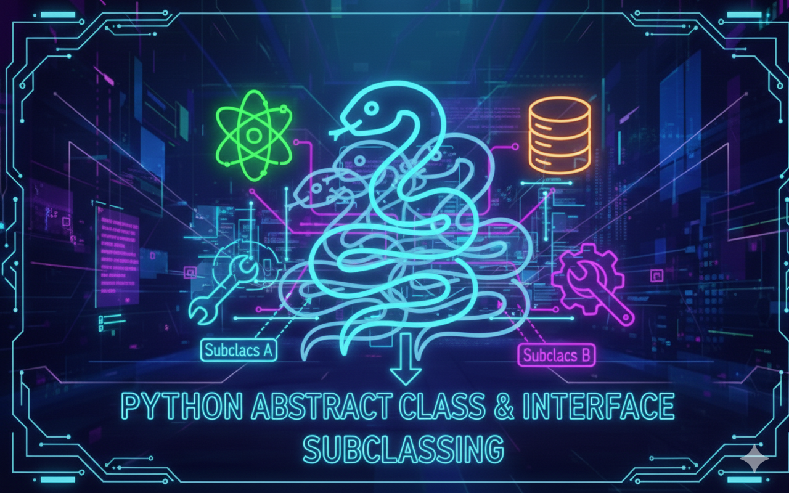

# Python - Abstract Classes and Interfaces

## Description
This project dives deeper into **Object-Oriented Programming in Python**, focusing on abstract classes, interfaces, duck typing, subclassing, multiple inheritance, and mixins.  
Through hands-on exercises, I explored how Python enforces contracts with abstract base classes, how flexibility emerges with duck typing, and how complex behaviors can be composed cleanly using inheritance and mixins.  
In short: less spaghetti code, more elegant dragons that can fly and swim 🐉.

---

## Learning Objectives
With this project, I learned how to:
- Define and use **abstract classes** to enforce method implementation.
- Design clear **interfaces** and rely on **duck typing** instead of rigid type checks.
- Extend **standard base classes** (like `list` and iterators) to customize behavior.
- Override methods safely to enhance or modify inherited behavior.
- Apply **multiple inheritance** and understand Python’s method resolution order (MRO).
- Use **mixins** to compose reusable behaviors without deep inheritance trees.
- Write cleaner, more flexible, and more maintainable object-oriented Python code.

---

## Requirements
- OS: Ubuntu 20.04 LTS
- Python version: `python3` (3.8.5)
- All files must end with a new line
- The first line of all files must be exactly: `#!/usr/bin/python3`
- A README.md file at the root of the project is mandatory
- Code must follow pycodestyle (version 2.7.*)
- All files must be executable
- No module imports allowed unless explicitly stated

---

## Usage / Execution
All Python scripts can be executed in two ways:

### 1. Direct execution
Make the file executable and run it directly:
```bash
chmod +x filename.py
./filename.py
```

### 2. Using Python interpreter
Run the script with Python:
```bash
python3 filename.py
```

---

## Project Progress
<p align="center">

</p>

<p align="center">
<sub>Mandatory tasks completion: 100% ---  Advanced tasks completion: 100%</sub>
</p>

---

## Tasks

### 0 - Abstract Animal Class and Subclasses
- **Task status:** Mandatory  
- **Task objectives:** Learn how to use abstract base classes to enforce method implementation in subclasses.  
- **Task constraint:** Use the `abc` module and define an abstract method.  
- **Expected behavior:** Subclasses implement the required method, and the abstract class cannot be instantiated.  

**Files**
- `task_00_abc.py`

---

### 1 - Shapes, Interfaces, and Duck Typing
- **Task status:** Mandatory  
- **Task objectives:** Understand interfaces through abstract classes and apply duck typing for polymorphism.  
- **Task constraint:** Do not use explicit type checking (`isinstance`).  
- **Expected behavior:** Different shape objects respond correctly to the same function calls.  

**Files**
- `task_01_duck_typing.py`

---

### 2 - Extending the Python List with Notifications
- **Task status:** Mandatory  
- **Task objectives:** Extend a built-in class to add custom behavior while preserving original functionality.  
- **Task constraint:** Use `super()` when overriding methods.  
- **Expected behavior:** Notifications are printed whenever the list is modified.  

**Files**
- `task_02_verboselist.py`

---

### 3 - CountedIterator
- **Task status:** Mandatory  
- **Task objectives:** Enhance an iterator to track how many elements have been iterated over.  
- **Task constraint:** Maintain the default iterator behavior, including `StopIteration`.  
- **Expected behavior:** The iterator correctly counts and reports the number of fetched items.  

**Files**
- `task_03_countediterator.py`

---

### 4 - The Enigmatic FlyingFish
- **Task status:** Mandatory  
- **Task objectives:** Explore multiple inheritance and method resolution order (MRO).  
- **Task constraint:** Correctly override methods inherited from multiple parent classes.  
- **Expected behavior:** The class combines behaviors from both parent classes with customized outputs.  

**Files**
- `task_04_flyingfish.py`

---

### 5 - The Mystical Dragon
- **Task status:** Mandatory  
- **Task objectives:** Use mixins to compose behaviors across unrelated classes.  
- **Task constraint:** Mixins must remain simple and focused on a single behavior.  
- **Expected behavior:** The final class demonstrates combined abilities from multiple mixins.  

**Files**
- `task_05_dragon.py`

---


## Authors
**Gwenaelle PICHOT**
- Student at Holberton School
- Track: Higher Level Programming
- Project: Python - Abstract Classes and Interfaces