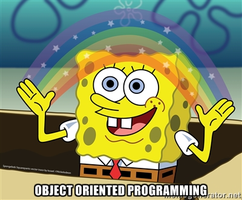

<p align="center">
  
</p>

# Python - Classes and Objects

> Welcome to the world of OOP — where everything is an object, even your mistakes.

---

## 📝 Description

This project is my introduction to Object-Oriented Programming (OOP) in Python. I build a `Square` class from scratch, iteratively adding features: private attributes, validation, properties, printing, positioning, and even comparison operators. Along the way, I also tackle a singly linked list and learn why encapsulation is not just a buzzword but a genuine design principle. By the end, I think in objects — and I can't go back.

---

## 🎯 Learning Objectives

By the end of this project, I am able to explain what OOP is and why Python treats everything as a first-class object. I understand what a class is, what an instance is, and the distinction between the two. I know how to use public, protected, and private attributes, and I understand the role of `self` and the `__init__` method. I can explain Data Abstraction, Encapsulation, and Information Hiding, and I know how to write properties and setters the Pythonic way. I am also able to dynamically create new attributes on instances, use `__dict__` to inspect objects, and retrieve attributes with `getattr`.

---

## 🛠️ Technologies Used

This project is written entirely in Python 3 (version 3.8.5), running on Ubuntu 20.04 LTS. No external modules are used. All modules, classes, and methods include proper docstrings. Code style is enforced with pycodestyle 2.7.*.

---

## ⚙️ Requirements

- OS: Ubuntu 20.04 LTS
- Python version: `python3` (3.8.5)
- All files must end with a new line
- The first line of all files must be exactly: `#!/usr/bin/python3`
- A README.md file at the root of the project is mandatory
- Code must follow pycodestyle (version 2.7.*)
- All files must be executable
- All modules, classes, and functions must have meaningful docstrings

---

## 🚀 Installation

```bash
git clone https://github.com/GwenP88/holbertonschool-higher_level_programming.git
cd holbertonschool-higher_level_programming/python-classes
```

---

## ▶️ Usage / Execution

All Python scripts can be executed in two ways:

### 1. Direct execution
```bash
chmod +x filename.py
./filename.py
```

### 2. Using Python interpreter
```bash
python3 filename.py
```

---

## 📊 Project Progress

<p align="center">

</p>

<p align="center">
<sub>Mandatory tasks completion: 100% --- Advanced tasks completion: 100%</sub>
</p>

---

## ✨ Features

### Task 0 - My first square

- Mandatory
- Define an empty class `Square` with no attributes or methods
- No imports allowed
- Creates a valid, empty `Square` object with an empty `__dict__`

**Files:** `0-square.py`

---

### Task 1 - Square with size

- Mandatory
- Add a private instance attribute `size`, set via `__init__`; no type or value validation yet
- No imports; `size` is stored as `_Square__size` due to name mangling
- Direct access to `size` or `__size` from outside raises `AttributeError`

**Files:** `1-square.py`

---

### Task 2 - Size validation

- Mandatory
- Add type and value validation: `size` must be a non-negative integer; raises `TypeError` or `ValueError` otherwise
- No imports; no `try/except` inside the class
- Invalid values raise descriptive exceptions at instantiation

**Files:** `2-square.py`

---

### Task 3 - Area of a square

- Mandatory
- Add a public `area()` method that returns the square's area (`size ** 2`)
- No imports; `size` is still private and validated
- Returns the correct integer area for any valid size

**Files:** `3-square.py`

---

### Task 4 - Access and update private attribute

- Mandatory
- Add a `size` property (getter) and setter with full validation; centralized type and value checking
- No imports; this is the Pythonic approach to controlled attribute access
- The property allows reading and updating `size` while enforcing constraints

**Files:** `4-square.py`

---

### Task 5 - Printing a square

- Mandatory
- Add a `my_print()` method that prints the square using `#` characters; prints an empty line if `size == 0`
- No imports; uses the `size` property internally
- Visual output of the square directly to stdout

**Files:** `5-square.py`

---

### Task 6 - Coordinates of a square

- Mandatory
- Add a `position` private attribute (tuple of 2 positive integers) with property and setter; `my_print()` uses position for offset
- No imports; `position` is validated with a `TypeError` if invalid; vertical offset uses blank lines, not spaces
- Square is printed at the correct position using space padding and blank lines

**Files:** `6-square.py`

---

### Task 7 - Singly linked list

- Advanced
- Implement a `Node` class (with `data` and `next_node` properties and validation) and a `SinglyLinkedList` class with a `sorted_insert` method
- No imports; `SinglyLinkedList` must be printable (one node per line); insertion maintains ascending sort order
- A sorted, printable singly linked list built entirely from scratch

**Files:** `100-singly_linked_list.py`

---

### Task 8 - Print Square instance

- Advanced
- Extend the `Square` class so that printing an instance directly (`print(my_square)`) behaves like calling `my_print()`
- No imports; implement `__str__` to return the same output as `my_print()`
- `print(square_instance)` produces the same visual output as `square_instance.my_print()`

**Files:** `101-square.py`

---

### Task 9 - Compare 2 squares

- Advanced
- Add comparison support to `Square` using `__eq__`, `__ne__`, `__lt__`, `__le__`, `__gt__`, `__ge__` based on area; `size` accepts floats too
- No imports; `size` must be a number (int or float); `ValueError` if negative
- Two squares can be compared with `==`, `!=`, `<`, `<=`, `>`, `>=` based on their computed areas

**Files:** `102-square.py`

---

## 🤝 Contributions & Acknowledgements

Thanks to Holberton School for making me care deeply about why `size` should be private. I didn't get it at first — then I did, and now I can't stop thinking about encapsulation. Worth it.

---

## 👤 Author

**Gwenaelle PICHOT**
- Student at Holberton School
- Track: holbertonschool-higher_level_programming
- Project: python-classes