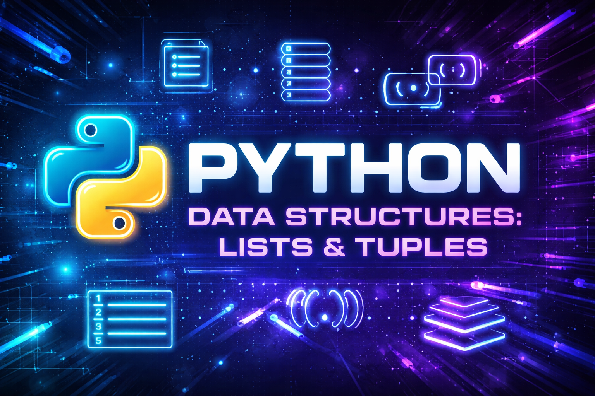

# Python – Data Structures: Lists, Tuples

## Description
This project is part of the **Holberton School – Higher Level Programming** curriculum.  
It focuses on understanding and using **Python data structures**, mainly **lists** and **tuples**, through a series of practical functions.

The goal is to learn how to manipulate collections of data efficiently while respecting strict coding constraints and style guidelines.

---

## Usage / Execution
All Python scripts can be executed in two ways:

### 1. Direct execution
Make the file executable and run it directly:
```bash
chmod +x filename.py
./filename.py
```

### 2. Using Python interpreter
Run the script with Python:
```bash
python3 filename.py
```

---

## Project Progress

<p align="center">
  
</p>

<p align="center">
  <sub>Mandatory tasks completion: 100%</sub>
</p>

---

## Learning Objectives

During this project, I learned what lists are and how to use them efficiently to store and manipulate multiple values in a single variable. 
I discovered the similarities between lists and strings (they both love being indexed) as well as their differences (lists are flexible, strings… much less).

I learned how to use common list methods without fighting with the documentation every five minutes, and how lists can behave like stacks or queues depending on how you use them. 
I also learned what list comprehensions are, and how they make the code shorter, cleaner, and slightly more satisfying to read.

I learned what tuples are and when it is smarter to use them instead of lists, especially when data should not be modified. 
Along the way, I understood what a sequence is in Python, how tuple packing and sequence unpacking work, and how the `del` statement can make things disappear (sometimes a bit too efficiently).

---

## Requirements

- **Language:** Python 3.8.5  
- **OS:** Ubuntu 20.04 LTS  
- **Editors:** `vi`, `vim`, `emacs`
- All files must:
  - End with a new line
  - Start with `#!/usr/bin/python3`
  - Be executable
  - Follow **pycodestyle** (version 2.7.\*)
- No external modules allowed unless specified
- File length is checked using `wc`

---

## Project Progress

<p align="center">
  
</p>

<p align="center">
  <sub>Mandatory tasks completion: 100%</sub>
</p>

---

## Tasks Overview

### 0. Print a list of integers
Prints each integer from a list on a new line using `str.format()`.

### 1. Secure access to an element in a list
Safely retrieves an element from a list by index without using `try/except`.

### 2. Replace element
Replaces an element at a given index in a list.

### 3. Print a list of integers in reverse
Prints all integers of a list in reverse order.

### 4. Replace in a copy
Returns a modified copy of a list without altering the original one.

### 5. Can you C me now?
Removes all occurrences of characters `c` and `C` from a string.

### 6. Lists of lists = Matrix
Prints a matrix of integers with proper formatting.

### 7. Tuples addition
Adds two tuples element-wise and returns a new tuple of two integers.

### 8. More returns!
Returns a tuple containing the length of a string and its first character.

### 9. Find the max
Finds and returns the largest integer in a list without using `max()`.

### 10. Only by 2
Returns a list of booleans indicating whether each element is divisible by 2.

### 11. Delete at
Deletes an element from a list at a given index without using `pop()`.

### 12. Switch
Swaps the values of two variables in exactly 5 lines of code.

---

## Author

**Gwenaelle PICHOT**  
Student at Holberton School  
Track: Higher Level Programming  
Project: Python - Date & structure (part 1)
