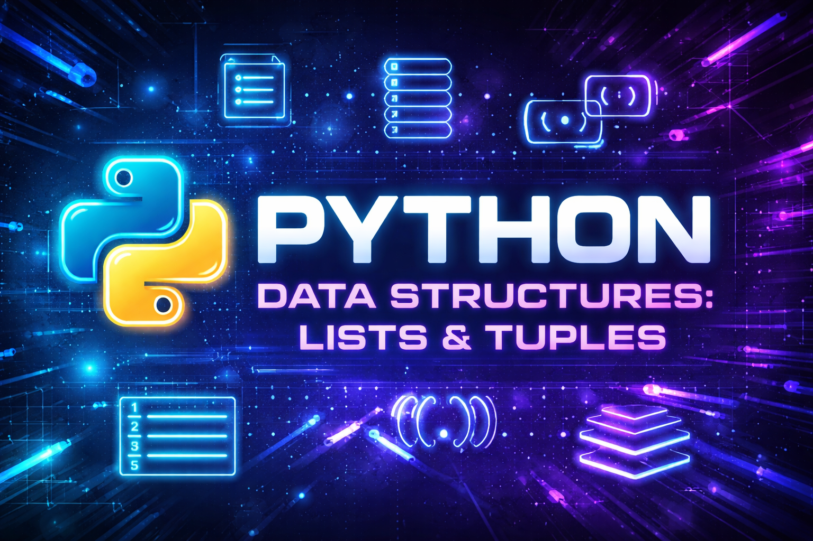

# Python – Data Structures: Lists, Tuples

## Description
This project is part of the **Holberton School – Higher Level Programming** curriculum.  
It focuses on understanding and using **Python data structures**, mainly **lists** and **tuples**, through a series of practical functions.

The goal is to learn how to manipulate collections of data efficiently while respecting strict coding constraints and style guidelines.

---

## Usage / Execution
All Python scripts can be executed in two ways:

### 1. Direct execution
Make the file executable and run it directly:
```bash
chmod +x filename.py
./filename.py
```

### 2. Using Python interpreter
Run the script with Python:
```bash
python3 filename.py
```

---

## Project Progress

<p align="center">
  
</p>

<p align="center">
  <sub>Mandatory tasks completion: 100%</sub>
</p>

---

## Learning Objectives

During this project, I learned what lists are and how to use them efficiently to store and manipulate multiple values in a single variable. 
I discovered the similarities between lists and strings (they both love being indexed) as well as their differences (lists are flexible, strings… much less).

I learned how to use common list methods without fighting with the documentation every five minutes, and how lists can behave like stacks or queues depending on how you use them. 
I also learned what list comprehensions are, and how they make the code shorter, cleaner, and slightly more satisfying to read.

I learned what tuples are and when it is smarter to use them instead of lists, especially when data should not be modified. 
Along the way, I understood what a sequence is in Python, how tuple packing and sequence unpacking work, and how the `del` statement can make things disappear (sometimes a bit too efficiently).

---

## Requirements

- **Language:** Python 3.8.5  
- **OS:** Ubuntu 20.04 LTS  
- **Editors:** `vi`, `vim`, `emacs`
- All files must:
  - End with a new line
  - Start with `#!/usr/bin/python3`
  - Be executable
  - Follow **pycodestyle** (version 2.7.\*)
- No external modules allowed unless specified
- File length is checked using `wc`

---

## Project Progress

<p align="center">
  
</p>

<p align="center">
  <sub>Mandatory tasks completion: 100%</sub>
</p>

---

## Tasks Overview

## Task "0" - "Print a list of integers"
- **Task status:** mandatory
- **Task objectives:** Print all integers of a list, one per line.
- **Task constraint:**
  - Use `str.format()`.
  - No import.
  - No casting to string.
- **Expected behavior:** One integer per line.
- **Files:** `python-data_structures/0-print_list_integer.py`


## Task "1" - "Secure access to an element in a list"
- **Task status:** mandatory
- **Task objectives:** Return element at given index.
- **Task constraint:**
  - If index < 0 or out of range → return `None`.
  - No import.
  - No `try/except`.
- **Expected behavior:** Returns element or `None`.
- **Files:** `python-data_structures/1-element_at.py`


## Task "2" - "Replace element"
- **Task status:** mandatory
- **Task objectives:** Replace element at specific index.
- **Task constraint:**
  - If index invalid → return original list.
  - No import.
  - No `try/except`.
- **Expected behavior:** Modified list (in place).
- **Files:** `python-data_structures/2-replace_in_list.py`


## Task "3" - "Print a list of integers... in reverse!"
- **Task status:** mandatory
- **Task objectives:** Print integers in reverse order.
- **Task constraint:**
  - Use `str.format()`.
  - No import.
  - No casting to string.
- **Expected behavior:** One integer per line (reversed).
- **Files:** `python-data_structures/3-print_reversed_list_integer.py`


## Task "4" - "Replace in a copy"
- **Task status:** mandatory
- **Task objectives:** Replace element without modifying original list.
- **Task constraint:**
  - If index invalid → return copy of original list.
  - No import.
  - No `try/except`.
- **Expected behavior:** New modified list, original unchanged.
- **Files:** `python-data_structures/4-new_in_list.py`


## Task "5" - "Can you C me now?"
- **Task status:** mandatory
- **Task objectives:** Remove all `c` and `C` from a string.
- **Task constraint:**
  - No import.
  - No `str.replace()`.
- **Expected behavior:** Return new string without `c` or `C`.
- **Files:** `python-data_structures/5-no_c.py`


## Task "6" - "Lists of lists = Matrix"
- **Task status:** mandatory
- **Task objectives:** Print a matrix of integers.
- **Task constraint:**
  - Use `str.format()`.
  - No import.
  - No casting to string.
- **Expected behavior:** Matrix format (rows on separate lines).
- **Files:** `python-data_structures/6-print_matrix_integer.py`


## Task "7" - "Tuples addition"
- **Task status:** mandatory
- **Task objectives:** Add two tuples.
- **Task constraint:**
  - Return tuple of 2 integers.
  - Missing values → use 0.
  - Ignore extra values.
  - No import.
- **Expected behavior:** Tuple with summed elements.
- **Files:** `python-data_structures/7-add_tuple.py`


## Task "8" - "More returns!"
- **Task status:** mandatory
- **Task objectives:** Return tuple (length, first character).
- **Task constraint:**
  - If string empty → first character is `None`.
  - No import.
- **Expected behavior:** `(length, first_character)`
- **Files:** `python-data_structures/8-multiple_returns.py`


## Task "9" - "Find the max"
- **Task status:** mandatory
- **Task objectives:** Find biggest integer in list.
- **Task constraint:**
  - If list empty → return `None`.
  - No import.
  - No builtin `max()`.
- **Expected behavior:** Return max integer.
- **Files:** `python-data_structures/9-max_integer.py`


## Task "10" - "Only by 2"
- **Task status:** mandatory
- **Task objectives:** Return list of booleans for multiples of 2.
- **Task constraint:**
  - Same size as original list.
  - No import.
- **Expected behavior:** True if divisible by 2, else False.
- **Files:** `python-data_structures/10-divisible_by_2.py`


## Task "11" - "Delete at"
- **Task status:** mandatory
- **Task objectives:** Delete element at specific index.
- **Task constraint:**
  - If index invalid → return original list.
  - No `pop()`.
  - No import.
- **Expected behavior:** Modified list (in place).
- **Files:** `python-data_structures/11-delete_at.py`


## Task "12" - "Switch"
- **Task status:** mandatory
- **Task objectives:** Swap values of `a` and `b`.
- **Task constraint:**
  - Code inserted at specified line.
  - Exactly 5 lines total.
- **Expected behavior:** Values of `a` and `b` switched.
- **Files:** `python-data_structures/12-switch.py`
  
---

## Author

**Gwenaelle PICHOT**  
Student at Holberton School  
Track: Higher Level Programming  
Project: Python - Date & structure (part 1)
