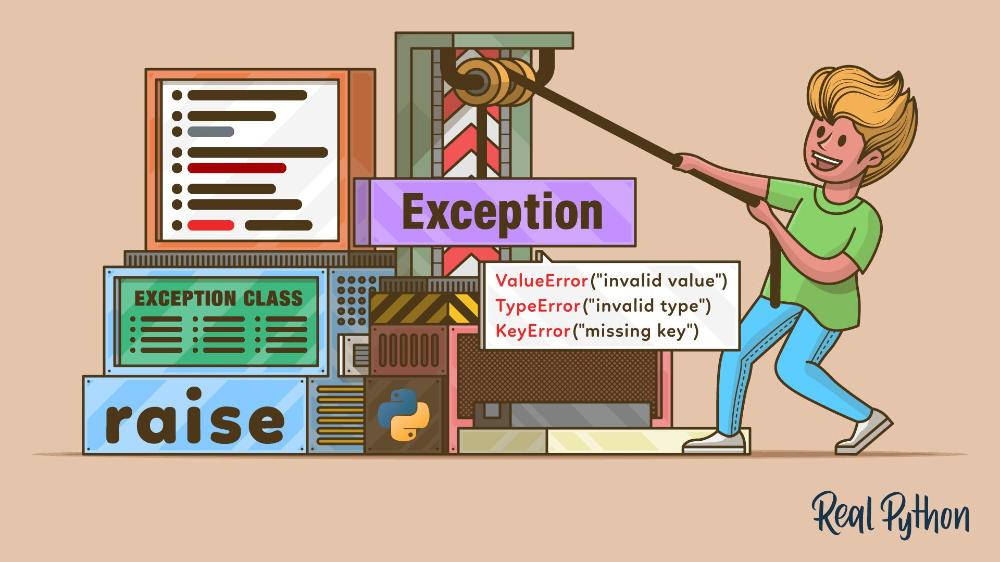

<p align="center">
  
</p>

# Python - Exceptions

> Because things go wrong — and a good developer is ready for it.

---

## 📝 Description

This project is all about handling the unexpected. I learn the difference between errors and exceptions in Python, and how to use `try`, `except`, `finally`, and `raise` to write code that doesn't crash and burn at the first sign of trouble. From safely printing integers to executing functions without blowing up the program, this project teaches me to anticipate failure and handle it gracefully — a skill that turns out to be very much mandatory in real-world development.

---

## 🎯 Learning Objectives

By the end of this project, I am able to explain the difference between errors and exceptions, and I know what exceptions are and how to use them properly. I understand when to use exception handling, how to correctly catch exceptions, and what the purpose of the `finally` block is. I can raise built-in exceptions intentionally with custom messages, and I know when to implement clean-up actions after an exception occurs.

---

## 🛠️ Technologies Used

This project is written entirely in Python 3 (version 3.8.5), running on Ubuntu 20.04 LTS. It relies exclusively on Python's built-in exception handling mechanisms — `try`, `except`, `finally`, and `raise`. Code style is enforced with pycodestyle 2.7.*. Some advanced tasks write error messages to `stderr` using the `sys` module.

---

## ⚙️ Requirements

- OS: Ubuntu 20.04 LTS
- Python version: `python3` (3.8.5)
- All files must end with a new line
- The first line of all files must be exactly: `#!/usr/bin/python3`
- A README.md file at the root of the project is mandatory
- Code must follow pycodestyle (version 2.7.*)
- All files must be executable
- No module imports allowed unless explicitly stated

---

## 🚀 Installation

```bash
git clone https://github.com/GwenP88/holbertonschool-higher_level_programming.git
cd holbertonschool-higher_level_programming/python-exceptions
```

---

## ▶️ Usage / Execution

All Python scripts can be executed in two ways:

### 1. Direct execution
Make the file executable and run it directly:
```bash
chmod +x filename.py
./filename.py
```

### 2. Using Python interpreter
Run the script with Python:
```bash
python3 filename.py
```

---

## 📊 Project Progress

<p align="center">

</p>

<p align="center">
<sub>Mandatory tasks completion: 100% --- Advanced tasks completion: 100%</sub>
</p>

---

## ✨ Features

### Task 0 - Safe list printing

- Mandatory
- Print `x` elements of a list safely using `try/except`; no `len()`, no imports
- `x` can exceed the list length without crashing the program
- Returns the actual number of elements printed

**Files:** `0-safe_print_list.py`

---

### Task 1 - Safe printing of an integers list

- Mandatory
- Print a value as an integer using `"{:d}".format()` inside a `try/except` block; no `type()`, no imports
- Returns `True` if the value was successfully printed as an integer, `False` otherwise

**Files:** `1-safe_print_integer.py`

---

### Task 2 - Print and count integers

- Mandatory
- Print the first `x` elements of a list, skipping non-integers silently; uses `try/except`, `"{:d}".format()`, no `len()`, no imports
- If `x` exceeds the list length, an `IndexError` is expected and raised
- Returns the count of integers actually printed

**Files:** `2-safe_print_list_integers.py`

---

### Task 3 - Integers division with debug

- Mandatory
- Divide two integers and always print the result in the `finally` block, preceded by `Inside result:`
- Uses `try/except/finally`; no imports
- Returns the division result, or `None` if a `ZeroDivisionError` occurs

**Files:** `3-safe_print_division.py`

---

### Task 4 - Divide a list

- Mandatory
- Divide two lists element by element and return a new list of results
- Uses `try/except/finally`; handles wrong types (`wrong type`), division by zero (`division by 0`), and out-of-range access (`out of range`) gracefully; no imports
- Returns a new list of length `list_length` with division results or `0` for failed divisions

**Files:** `4-list_division.py`

---

### Task 5 - Raise exception

- Mandatory
- Raise a `TypeError` exception intentionally
- No imports
- Always raises a `TypeError` when called

**Files:** `5-raise_exception.py`

---

### Task 6 - Raise a message

- Mandatory
- Raise a `NameError` exception with a custom message
- No imports
- Raises a `NameError` with the provided message string

**Files:** `6-raise_exception_msg.py`

---

### Task 7 - Safe integer print with error message

- Advanced
- Print a value as an integer; on failure, print the error to `stderr` preceded by `Exception:`
- Uses `try/except`, `"{:d}".format()`; no `type()` allowed
- Returns `True` on success, `False` on failure (with error output to `stderr`)

**Files:** `100-safe_print_integer_err.py`

---

### Task 8 - Safe function

- Advanced
- Execute any function safely, catching any exception and printing it to `stderr` preceded by `Exception:`
- Uses `try/except`; the first argument is always a function pointer
- Returns the function's result, or `None` if an exception occurs

**Files:** `101-safe_function.py`

---

### Task 9 - ByteCode -> Python #4

- Advanced
- Reverse-engineer a Python bytecode block and rewrite the equivalent Python function `magic_calculation(a, b)`
- The function must replicate the exact logic encoded in the given bytecode
- Returns the result matching the bytecode's behavior, using a loop, exception handling, and conditional raising

**Files:** `102-magic_calculation.py`

---

## 🤝 Contributions & Acknowledgements

Thanks to everyone at Holberton School for reminding me that a good `try/except` block is not admitting defeat — it's engineering maturity. Also, shout-out to the bytecode task for the existential crisis it provided.

---

## 👤 Author

**Gwenaelle PICHOT**
- Student at Holberton School
- Track: holbertonschool-higher_level_programming
- Project: python-exceptions