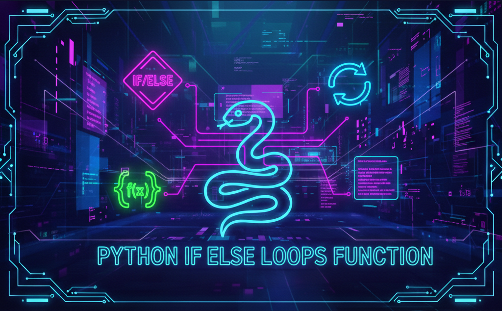

# Python - if/else, loops, functions

## Description
This project is an introduction to **control flow** and **functions** in Python.  
You will practice using `if/else`, `while` and `for` loops, basic arithmetic operators, and writing simple functions while respecting **pycodestyle** rules.

---

## Learning Objectives
By the end of this project, you should be able to explain:

- Why **indentation** is so important in Python
- How to use `if`, `if ... else`
- How to use comments
- How to assign values to variables
- How to use `while` and `for` loops
- How to use `break` and `continue`
- How to use `else` clauses on loops
- What `pass` does and when to use it
- How to use `range()`
- What a function is and how to use functions
- What a function returns if it has no `return` statement
- Variable scope
- What a traceback is
- Arithmetic operators and how to use them

---

## Requirements

### Python Scripts
- Allowed editors: `vi`, `vim`, `emacs`
- All files will be interpreted/compiled on **Ubuntu 20.04 LTS** using **python3 (version 3.8.\*)**
- All files should end with a new line
- The first line of all files should be exactly: `#!/usr/bin/python3`
- A `README.md` file at the root of the project folder is mandatory
- Code must follow **pycodestyle (version 2.7.\*)**
- All files must be executable
- File length will be tested using `wc`

---

## Tasks

### 0. Positive anything is better than negative nothing
**File:** `0-positive_or_negative.py`  
Print whether a randomly generated number is positive, zero, or negative.

Expected output format:
- `{number} is positive` if `number > 0`
- `{number} is zero` if `number == 0`
- `{number} is negative` if `number < 0`

---

### 1. The last digit
**File:** `1-last_digit.py`  
Print the last digit of a randomly generated number and describe it:

- `and is greater than 5` if last digit > 5
- `and is 0` if last digit == 0
- `and is less than 6 and not 0` otherwise

---

### 2. I sometimes suffer from insomnia...
**File:** `2-print_alphabet.py`  
Print the ASCII alphabet in lowercase, **without** a new line.

Constraints:
- Only one `print` with string format
- Only one loop
- No storing characters in a variable
- No imports

---

### 3. When I was having that alphabet soup...
**File:** `3-print_alphabt.py`  
Print the ASCII alphabet in lowercase **except** `q` and `e`, **without** a new line.

Constraints:
- Only one `print` with string format
- Only one loop
- No storing characters in a variable
- No imports

---

### 4. Hexadecimal printing
**File:** `4-print_hexa.py`  
Print numbers from 0 to 98 in decimal and hexadecimal.

Constraints:
- Only one `print` with string format
- Only one loop
- No storing numbers/strings in a variable
- No imports

Example:
`0 = 0x0`

---

### 5. 00...99
**File:** `5-print_comb2.py`  
Print numbers from 00 to 99 separated by `, `.

Rules:
- Two digits (leading zero allowed)
- Ascending order
- Last number followed by a new line

Constraints:
- Max 2 `print` with string format
- Only one loop
- No storing numbers/strings in a variable
- No imports

---

### 6. Inventing is a combination of brains and materials...
**File:** `6-print_comb3.py`  
Print all different combinations of two digits.

Rules:
- Two digits must be different
- `01` and `10` are the same → print only the smallest combination
- Ascending order, two digits
- Separated by `, `
- Last combination followed by a new line

Constraints:
- Max 3 `print` with string format
- Max 2 loops
- No storing numbers/strings in a variable
- No imports

---

### 7. islower
**File:** `7-islower.py`  
Write a function that checks for lowercase character.

Prototype:
- `def islower(c):`

Returns:
- `True` if `c` is lowercase
- `False` otherwise

Constraints:
- No imports
- Do not use `str.upper()` or `str.isupper()`
- Tip: `ord()`

---

### 8. To uppercase
**File:** `8-uppercase.py`  
Write a function that prints a string in uppercase followed by a new line.

Prototype:
- `def uppercase(str):`

Constraints:
- Max 2 `print` with string format
- Only one loop
- No imports
- Do not use `str.upper()` or `str.isupper()`
- Tip: `ord()`

---

### 9. There are only 3 colors...
**File:** `9-print_last_digit.py`  
Write a function that prints the last digit of a number and returns it.

Prototype:
- `def print_last_digit(number):`

Returns:
- The value of the last digit

Constraints:
- No imports

---

### 10. a + b
**File:** `10-add.py`  
Write a function that adds two integers and returns the result.

Prototype:
- `def add(a, b):`

Returns:
- `a + b`

Constraints:
- No imports

---

### 11. a ^ b
**File:** `11-pow.py`  
Write a function that computes `a` to the power of `b`.

Prototype:
- `def pow(a, b):`

Returns:
- `a ^ b`

Constraints:
- No imports

---

### 12. Fizz Buzz
**File:** `12-fizzbuzz.py`  
Write a function that prints numbers from 1 to 100 separated by a space.

Rules:
- Multiples of 3 → `Fizz`
- Multiples of 5 → `Buzz`
- Multiples of both → `FizzBuzz`
- Each element followed by a space

Prototype:
- `def fizzbuzz():`

Constraints:
- No imports

---

### 13. Smile in the mirror
**#advanced**  
**File:** `100-print_tebahpla.py`

- Prints the ASCII alphabet in reverse order  
- Alternates lowercase and uppercase letters  
  - Starts with `z` in lowercase, then `Y` in uppercase  
- Output is **not** followed by a new line  
- Uses **only one** `print` function with string formatting  
- Uses **only one** loop  
- Does **not** store characters in variables  
- Does **not** import any module  

---

### 14. Remove at position
**#advanced**  
**File:** `101-remove_char_at.py`

- Creates a copy of a string without the character at position `n`  
- Indexing follows C-style logic (not Python slicing shortcuts)  
- Returns the original string if `n` is out of range or negative  
- Uses **no** module imports  
- Does not require understanding of `__import__`  

---

## Author

**Gwenaelle PICHOT**  
Student at Holberton School  
Track: Higher Level Programming  
Project: Python - If, else, loops & functions
