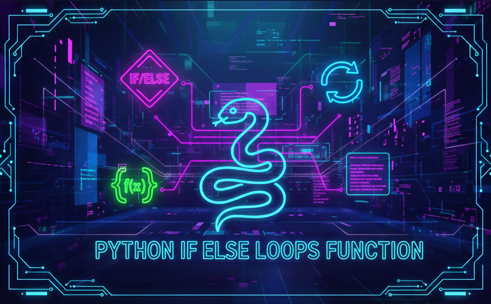

<p align="center">
  
</p>

# Python - if/else, Loops, Functions

> Teaching Python to make decisions, go in circles, and do things on command — just like a well-trained intern.

---

## 📝 Description

This project dives into the control flow structures and functions that form the backbone of any Python program. I explore conditional statements, loops, and how to write reusable functions from scratch. Along the way, I get comfortable with Python's strict indentation rules, the `range` function, arithmetic operators, and how variable scope works. This is where Python starts to feel less like a toy and more like a real tool.

---

## 🎯 Learning Objectives

By the end of this project, I am able to explain why indentation is not just a style preference in Python but a fundamental part of the language's syntax. I know how to use `if`, `if...else`, and `elif` statements to control program flow, and how to use comments to make my code readable. I understand how to assign values to variables and how to use `while` and `for` loops effectively, including the `break`, `continue`, and `else` clauses. I know what the `pass` statement does and when it is appropriate to use it. I am able to use `range` to generate sequences and write my own functions with parameters and return values. I also understand what happens when a function has no `return` statement, how variable scope works in Python, what a traceback is and how to read one, and how to use arithmetic operators confidently.

---

## 🛠️ Technologies Used

This project uses Python 3 (version 3.8.*), interpreted on Ubuntu 20.04 LTS. Style compliance is enforced with pycodestyle (version 2.7.*). No external libraries or module imports are used unless explicitly required by the task.

---

## ⚙️ Requirements

- OS: Ubuntu 20.04 LTS
- Python version: `python3` (3.8.*)
- All files must end with a new line
- The first line of all files must be exactly: `#!/usr/bin/python3`
- A README.md file at the root of the project folder is mandatory
- Code must follow pycodestyle (version 2.7.*)
- All files must be executable
- File length is tested using `wc`
- Note: lists are not required for this project

---

## 🚀 Installation

```bash
git clone https://github.com/GwenP88/holbertonschool-higher_level_programming.git
cd holbertonschool-higher_level_programming/python-if_else_loops_functions
```

---

## ▶️ Usage / Execution

All Python scripts can be executed in two ways:

### 1. Direct execution
Make the file executable and run it directly:
```bash
chmod +x filename.py
./filename.py
```

### 2. Using Python interpreter
Run the script with Python:
```bash
python3 filename.py
```

---

## 📊 Project Progress

<p align="center">

</p>

<p align="center">
<sub>Mandatory tasks completion: 100% --- Advanced tasks completion: 100%</sub>
</p>

---

## ✨ Features

### Task 0 - Positive anything is better than negative nothing

- **Status:** Mandatory
- **Objective:** Complete a script that prints whether a randomly assigned number is positive, zero, or negative.
- **Constraint:** Do not modify the random number generation code. Use `if/elif/else` logic.
- **Expected behavior:** The script prints `X is positive`, `X is zero`, or `X is negative` depending on the value of `number`.

**Files:** `0-positive_or_negative.py`

---

### Task 1 - The last digit

- **Status:** Mandatory
- **Objective:** Print the last digit of a randomly assigned number along with a contextual message.
- **Constraint:** Do not modify the `random.randint` line. Handle negative numbers correctly.
- **Expected behavior:** The script prints the last digit and whether it is greater than 5, equal to 0, or less than 6 and not 0.

**Files:** `1-last_digit.py`

---

### Task 2 - I sometimes suffer from insomnia. And when I can't fall asleep, I play what I call the alphabet game

- **Status:** Mandatory
- **Objective:** Print the ASCII alphabet in lowercase on a single line without a trailing newline.
- **Constraint:** Only one `print` function with string format, only one loop. No variable storage, no imports.
- **Expected behavior:** Running `./2-print_alphabet.py` prints `abcdefghijklmnopqrstuvwxyz` with no newline at the end.

**Files:** `2-print_alphabet.py`

---

### Task 3 - When I was having that alphabet soup, I never thought that it would pay off

- **Status:** Mandatory
- **Objective:** Print the ASCII alphabet in lowercase, excluding the letters `q` and `e`.
- **Constraint:** Only one `print` function, one loop, no variable storage, no imports.
- **Expected behavior:** Running `./3-print_alphabt.py` prints the full alphabet minus `q` and `e`, with no trailing newline.

**Files:** `3-print_alphabt.py`

---

### Task 4 - Hexadecimal printing

- **Status:** Mandatory
- **Objective:** Print all numbers from 0 to 98 in both decimal and hexadecimal format.
- **Constraint:** Only one `print` function with string format, one loop. No variable storage, no imports.
- **Expected behavior:** Each line follows the format `X = 0xY`, showing the decimal and hex values side by side.

**Files:** `4-print_hexa.py`

---

### Task 5 - 00...99

- **Status:** Mandatory
- **Objective:** Print numbers from 0 to 99 separated by commas and spaces, each formatted as two digits.
- **Constraint:** Maximum 2 `print` functions, one loop. No variable storage, no imports.
- **Expected behavior:** Output is a single comma-separated line from `00` to `99`, followed by a newline.

**Files:** `5-print_comb2.py`

---

### Task 6 - Inventing is a combination of brains and materials. The more brains you use, the less material you need

- **Status:** Mandatory
- **Objective:** Print all unique two-digit combinations where both digits are different, in ascending order.
- **Constraint:** Maximum 3 `print` functions, 2 loops. No variable storage, no imports. Only the smaller combination is printed (e.g., `01` not `10`).
- **Expected behavior:** Output is a comma-separated list of all valid unique two-digit combinations.

**Files:** `6-print_comb3.py`

---

### Task 7 - islower

- **Status:** Mandatory
- **Objective:** Write a function that checks whether a character is lowercase.
- **Constraint:** No imports. Cannot use `str.upper()` or `str.isupper()`. Use `ord()` instead.
- **Expected behavior:** `islower("a")` returns `True`, `islower("H")` returns `False`, and non-letter characters return `False`.

**Files:** `7-islower.py`

---

### Task 8 - To uppercase

- **Status:** Mandatory
- **Objective:** Write a function that prints a string in uppercase followed by a newline.
- **Constraint:** Maximum 2 `print` functions, one loop. No imports, no `str.upper()` or `str.isupper()`. Use `ord()`.
- **Expected behavior:** `uppercase("best")` prints `BEST`. Works for strings containing spaces and digits.

**Files:** `8-uppercase.py`

---

### Task 9 - There are only 3 colors, 10 digits, and 7 notes; it's what we do with them that's important

- **Status:** Mandatory
- **Objective:** Write a function that prints and returns the last digit of a number.
- **Constraint:** No imports. Must handle negative numbers correctly.
- **Expected behavior:** `print_last_digit(98)` prints and returns `8`. `print_last_digit(-1024)` prints and returns `4`.

**Files:** `9-print_last_digit.py`

---

### Task 10 - a + b

- **Status:** Mandatory
- **Objective:** Write a function that adds two integers and returns the result.
- **Constraint:** No imports.
- **Expected behavior:** `add(1, 2)` returns `3`. `add(100, -2)` returns `98`.

**Files:** `10-add.py`

---

### Task 11 - a ^ b

- **Status:** Mandatory
- **Objective:** Write a function that computes `a` to the power of `b` and returns the result.
- **Constraint:** No imports.
- **Expected behavior:** `pow(2, 2)` returns `4`. `pow(100, -2)` returns `0.0001`. `pow(-4, 5)` returns `-1024`.

**Files:** `11-pow.py`

---

### Task 12 - Fizz Buzz

- **Status:** Mandatory
- **Objective:** Write a function that prints numbers from 1 to 100, replacing multiples of 3 with `Fizz`, multiples of 5 with `Buzz`, and multiples of both with `FizzBuzz`.
- **Constraint:** No imports. Each element must be followed by a space.
- **Expected behavior:** Running `./12-main.py` produces the classic FizzBuzz sequence from 1 to 100, space-separated.

**Files:** `12-fizzbuzz.py`

---

### Task 13 - Smile in the mirror

- **Status:** Advanced
- **Objective:** Print the ASCII alphabet in reverse order, alternating between lowercase and uppercase (starting with `z` lowercase, then `Y` uppercase, etc.).
- **Constraint:** Only one `print` function, one loop. No variable storage, no imports.
- **Expected behavior:** Running `./100-print_tebahpla.py` prints `zYxWvUtSrQpOnMlKjIhGfEdCbA` with no trailing newline.

**Files:** `100-print_tebahpla.py`

---

### Task 14 - Remove at position

- **Status:** Advanced
- **Objective:** Write a function that returns a copy of a string with the character at position `n` removed (C-style index, not Python-style).
- **Constraint:** No imports.
- **Expected behavior:** `remove_char_at("Best School", 3)` returns `Bes School`. Handles edge cases like out-of-range and negative indices gracefully.

**Files:** `101-remove_char_at.py`

---

## 🤝 Contributions & Acknowledgements

Thanks to the Holberton School team for the cleverly titled tasks — turns out Tim Peters' Zen, alphabet soup, and insomnia all have something to teach about Python. Thanks also to `ord()` for making character manipulation surprisingly satisfying without importing anything.

---

## 👤 Author

**Gwenaelle PICHOT**
- Student at Holberton School
- Track: holbertonschool-higher_level_programming
- Project: python-if_else_loops_functions