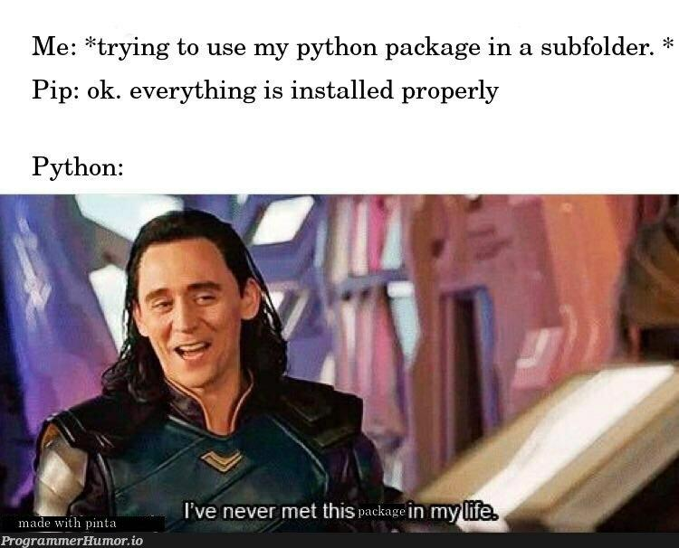

<p align="center">
  
</p>

# Python - import & modules

> Why write everything yourself when Python lets you borrow from others? (Legally, this time.)

---

## 📝 Description

This project explores one of Python's most powerful features: the ability to import and reuse code across files. I learn how to create modules, import specific functions or variables from them, and use command-line arguments to make scripts dynamic and flexible. I also discover how to prevent code from running on import, how to use the built-in `dir()` function to inspect modules, and how Python handles arbitrarily large numbers with ease. Think of this project as building my first real toolbox.

---

## 🎯 Learning Objectives

By the end of this project, I am able to explain why Python programming is considered a joy to work with, particularly because of its clean syntax and powerful standard library. I know how to import functions from another file and use them in a new script, how to create my own modules, and how to use the built-in `dir()` function to inspect what a module exposes. I understand how to prevent code from being executed when a script is imported by using the `if __name__ == "__main__":` guard. I am also able to use command-line arguments in my Python programs by working with `sys.argv`, making my scripts dynamic and reusable from the terminal.

---

## 🛠️ Technologies Used

This project uses Python 3 (version 3.10.*), interpreted on Ubuntu 22.04 LTS. Style compliance is enforced with pycodestyle (version 2.7.*). No external libraries are required — just Python, its standard library, and some well-placed imports.

---

## ⚙️ Requirements

- OS: Ubuntu 22.04 LTS
- Python version: `python3` (3.10.*)
- All files must end with a new line
- The first line of all files must be exactly: `#!/usr/bin/python3`
- A README.md file at the root of the project folder is mandatory
- Code must follow pycodestyle (version 2.7.*)
- All files must be executable
- File length is tested using `wc`
- No use of `*` for importing or `__import__` unless explicitly stated
- All scripts must be protected from execution when imported

---

## 🚀 Installation

```bash
git clone https://github.com/GwenP88/holbertonschool-higher_level_programming.git
cd holbertonschool-higher_level_programming/python-import_modules
```

---

## ▶️ Usage / Execution

All Python scripts can be executed in two ways:

### 1. Direct execution
Make the file executable and run it directly:
```bash
chmod +x filename.py
./filename.py
```

### 2. Using Python interpreter
Run the script with Python:
```bash
python3 filename.py
```

Some scripts accept command-line arguments:
```bash
./2-args.py Hello World
./3-infinite_add.py 10 20 30
./100-my_calculator.py 10 + 5
```

---

## 📊 Project Progress

<p align="center">

</p>

<p align="center">
<sub>Mandatory tasks completion: 100% --- Advanced tasks completion: 100%</sub>
</p>

---

## ✨ Features

### Task 0 - Import a simple function from a simple file

- **Status:** Mandatory
- **Objective:** Import the `add` function from `add_0.py` and print the result of `1 + 2 = 3`.
- **Constraint:** Use f-strings. Variables `a` and `b` must be defined on separate lines. The word `add_0` may only appear once. No `*` import or `__import__`. Script must not run on import.
- **Expected behavior:** Running `./0-add.py` prints `1 + 2 = 3`.

**Files:** `0-add.py`

---

### Task 1 - My first toolbox!

- **Status:** Mandatory
- **Objective:** Import all four math functions from `calculator_1.py` and print the results of addition, subtraction, multiplication, and division.
- **Constraint:** Maximum 4 `print` calls. Variables `a = 10` and `b = 5` defined on separate lines and used exclusively. `calculator_1` appears only once. Script must not run on import.
- **Expected behavior:** Running `./1-calculation.py` prints `10 + 5 = 15`, `10 - 5 = 5`, `10 * 5 = 50`, `10 / 5 = 2`.

**Files:** `1-calculation.py`

---

### Task 2 - How to make a script dynamic!

- **Status:** Mandatory
- **Objective:** Write a script that prints the number of command-line arguments passed and lists each one with its position.
- **Constraint:** Script must not run on import. Handle singular/plural grammar (`argument` vs `arguments`). Use `.` if no arguments, `:` otherwise.
- **Expected behavior:** Running `./2-args.py Hello World` prints `2 arguments:` followed by `1: Hello` and `2: World`.

**Files:** `2-args.py`

---

### Task 3 - Infinite addition

- **Status:** Mandatory
- **Objective:** Write a script that prints the sum of all command-line arguments, cast to integers.
- **Constraint:** Script must not run on import. Must handle very large numbers correctly.
- **Expected behavior:** Running `./3-infinite_add.py 79 10` prints `89`. Also handles numbers with hundreds of digits.

**Files:** `3-infinite_add.py`

---

### Task 4 - Who are you?

- **Status:** Mandatory
- **Objective:** Print all names defined in a compiled module (`hidden_4.pyc`), excluding those starting with `__`, in alphabetical order.
- **Constraint:** Must be run from `/tmp/` in the sandbox. Script must not run on import.
- **Expected behavior:** Running `./4-hidden_discovery.py | sort` prints the exported names: `my_secret_santa`, `print_hidden`, `print_school`.

**Files:** `4-hidden_discovery.py`

---

### Task 5 - Everything can be imported

- **Status:** Mandatory
- **Objective:** Import a variable `a` from `variable_load_5.py` and print its value.
- **Constraint:** No `*` import or `__import__`. Script must not run on import.
- **Expected behavior:** Running `./5-variable_load.py` prints `98`.

**Files:** `5-variable_load.py`

---

### Task 6 - Build my own calculator!

- **Status:** Advanced
- **Objective:** Write a command-line calculator that imports all functions from `calculator_1.py` and handles `+`, `-`, `*`, and `/` operations.
- **Constraint:** Usage: `./100-my_calculator.py a operator b`. Print an error and exit with code `1` if the argument count is wrong or the operator is unknown. No `*` import. Script must not run on import.
- **Expected behavior:** Running `./100-my_calculator.py 3 + 5` prints `3 + 5 = 8`. Invalid usage prints descriptive error messages.

**Files:** `100-my_calculator.py`

---

### Task 7 - Easy print

- **Status:** Advanced
- **Objective:** Print `#pythoniscool` followed by a newline, without using `print`, `eval`, `open`, or `import sys`.
- **Constraint:** Maximum 2 lines long.
- **Expected behavior:** Running `./101-easy_print.py` prints `#pythoniscool`.

**Files:** `101-easy_print.py`

---

### Task 8 - ByteCode -> Python #3

- **Status:** Advanced
- **Objective:** Write a Python function `magic_calculation(a, b)` that replicates the exact behavior described by a given Python bytecode listing.
- **Constraint:** The function must import `add` and `sub` from `magic_calculation_102`, and reproduce the bytecode logic precisely (conditional branching and loop over a range).
- **Expected behavior:** The function returns `sub(a, b)` if `a >= b`, otherwise it returns `add(a, b)` incremented by values from `range(4, 6)`.

**Files:** `102-magic_calculation.py`

---

### Task 9 - Fast alphabet

- **Status:** Advanced
- **Objective:** Print the uppercase alphabet followed by a newline.
- **Constraint:** Maximum 3 lines long. No loops, no conditional statements, no `str.join()`, no string literals, no system calls.
- **Expected behavior:** Running `./103-fast_alphabet.py` prints `ABCDEFGHIJKLMNOPQRSTUVWXYZ`.

**Files:** `103-fast_alphabet.py`

---

## 🤝 Contributions & Acknowledgements

Thanks to the Holberton School team for reminding me that good programmers don't reinvent the wheel — they import it. Also, a nod to Python's integer system for handling absurdly large numbers without breaking a sweat. That infinite addition task was a pleasant surprise.

---

## 👤 Author

**Gwenaelle PICHOT**
- Student at Holberton School
- Track: holbertonschool-higher_level_programming
- Project: python-import_modules