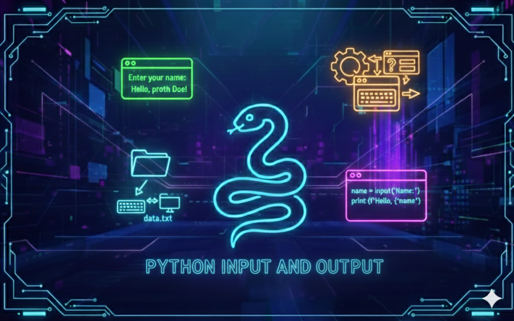

# Python - Input/Output

## Description
In this project, I explored one of the most underrated superpowers in programming: **talking to files without panicking**.  
I learned how to read and write text files safely using `with`, how to move between Python objects and JSON (serialization / deserialization), and how to store & reload data like a tiny database (but without the drama of SQL… for now).  
By the end, I could save lists, dictionaries, and even class instances to disk, reload them later, and keep my scripts clean, predictable, and automation-friendly.

---

## Learning Objectives
With this project, I learned to:
- open files like a responsible adult (and close them automatically, because I *will* forget otherwise),
- write text without sacrificing previous content (or accidentally erasing everything… again),
- read files fully or line-by-line like a detective,
- move smoothly between **Python objects** and **JSON** like a bilingual developer,
- serialize and deserialize data (aka “turn stuff into text, and resurrect it later”),
- use command line arguments to make my scripts feel like real tools,
- and finally understand why Python is awesome: it lets me do serious things with suspiciously little code.

---

## Requirements
- OS: Ubuntu 20.04 LTS
- Python version: `python3` (3.8.5)
- All files must end with a new line
- The first line of all files must be exactly: `#!/usr/bin/python3`
- A README.md file at the root of the project is mandatory
- Code must follow pycodestyle (version 2.7.*)
- All files must be executable
- No module imports allowed unless explicitly stated

---

## Usage / Execution
All Python scripts can be executed in two ways:

### 1. Direct execution
Make the file executable and run it directly:
```bash
chmod +x filename.py
./filename.py
```

### 2. Using Python interpreter
Run the script with Python:
```bash
python3 filename.py
```

---

## Project Progress
<p align="center">

</p>

<p align="center">
<sub>Mandatory tasks completion: 100% ---  Advanced tasks completion: 100%</sub>
</p>

---

## Tasks

### Task 0 - Read file
- **Task status:** mandatory  
- **Task objectives:** Read a UTF-8 text file and print its content to stdout.  
- **Task constraint:** Must use the `with` statement. No imports allowed. No need to handle missing files or permission errors.  
- **Expected behavior:** Prints the full content exactly as stored in the file.  

**Files**
- `0-read_file.py`

---

### Task 1 - Write to a file
- **Task status:** mandatory  
- **Task objectives:** Write a string into a UTF-8 text file and return the number of characters written.  
- **Task constraint:** Must use the `with` statement. No imports allowed. Create the file if it doesn’t exist. Overwrite if it exists.  
- **Expected behavior:** Writes the provided text to the file and returns the character count.  

**Files**
- `1-write_file.py`

---

### Task 2 - Append to a file
- **Task status:** mandatory  
- **Task objectives:** Append a string to the end of a UTF-8 text file and return the number of characters added.  
- **Task constraint:** Must use the `with` statement. No imports allowed. Create the file if it doesn’t exist.  
- **Expected behavior:** Adds text at the end without overwriting existing content, and returns the number of characters appended.  

**Files**
- `2-append_write.py`

---

### Task 3 - To JSON string
- **Task status:** mandatory  
- **Task objectives:** Convert a Python object into its JSON string representation.  
- **Task constraint:** No need to handle serialization exceptions (if object isn’t JSON-serializable).  
- **Expected behavior:** Returns a JSON-formatted string (type `str`) representing the given object.  

**Files**
- `3-to_json_string.py`

---

### Task 4 - From JSON string to Object
- **Task status:** mandatory  
- **Task objectives:** Convert a JSON string into the corresponding Python data structure.  
- **Task constraint:** No need to handle exceptions if the JSON is invalid.  
- **Expected behavior:** Returns the reconstructed Python object (list, dict, etc.) from the JSON string.  

**Files**
- `4-from_json_string.py`

---

### Task 5 - Save Object to a file
- **Task status:** mandatory  
- **Task objectives:** Serialize a Python object into JSON and write it to a file.  
- **Task constraint:** Must use the `with` statement. No need to handle permission errors or serialization errors.  
- **Expected behavior:** Creates/overwrites the file with the JSON representation of the object.  

**Files**
- `5-save_to_json_file.py`

---

### Task 6 - Create object from a JSON file
- **Task status:** mandatory  
- **Task objectives:** Read a JSON file and deserialize its content into a Python object.  
- **Task constraint:** Must use the `with` statement. No need to handle errors (missing file, bad JSON, permissions).  
- **Expected behavior:** Returns the reconstructed Python object from the file’s JSON content.  

**Files**
- `6-load_from_json_file.py`

---

### Task 7 - Load, add, save
- **Task status:** mandatory  
- **Task objectives:** Build a script that stores command line arguments into a persistent JSON list.  
- **Task constraint:** Must reuse `save_to_json_file` (Task 5) and `load_from_json_file` (Task 6). File name must be `add_item.json`.  
- **Expected behavior:** Loads the list from `add_item.json` (or creates it), adds all new CLI args, then saves the updated list back to disk.  

**Files**
- `7-add_item.py`

---

### Task 8 - Class to JSON
- **Task status:** mandatory  
- **Task objectives:** Convert a class instance into a dictionary suitable for JSON serialization.  
- **Task constraint:** No imports allowed. Attributes are guaranteed to be simple JSON-friendly types.  
- **Expected behavior:** Returns a dictionary representing the instance attributes (including name-mangled private ones if they exist in `__dict__`).  

**Files**
- `8-class_to_json.py`

---

### Task 9 - Student to JSON
- **Task status:** mandatory  
- **Task objectives:** Create a `Student` class with a method that returns its JSON-ready dictionary representation.  
- **Task constraint:** No imports allowed. Must include public attributes `first_name`, `last_name`, `age`.  
- **Expected behavior:** `to_json()` returns a dict containing all public attributes of the instance.  

**Files**
- `9-student.py`

---

### Task 10 - Student to JSON with filter
- **Task status:** mandatory  
- **Task objectives:** Enhance `Student.to_json()` to optionally return only selected attributes.  
- **Task constraint:** If `attrs` is a list of strings, return only matching attributes. Otherwise return all attributes.  
- **Expected behavior:** Produces a filtered dictionary when requested, ignoring unknown attribute names.  

**Files**
- `10-student.py`

---

### Task 11 - Student to disk and reload
- **Task status:** mandatory  
- **Task objectives:** Add a method to update a `Student` instance using a dictionary (basic deserialization mechanism).  
- **Task constraint:** `reload_from_json(self, json)` receives a dictionary where keys are attribute names and values are attribute values.  
- **Expected behavior:** Replaces/sets attributes on the instance based on the provided dictionary.  

**Files**
- `11-student.py`

---

### Task 12 - Pascal's Triangle
- **Task status:** mandatory  
- **Task objectives:** Build Pascal’s triangle up to `n` rows (interview-style).  
- **Task constraint:** No imports allowed. Return an empty list if `n <= 0`.  
- **Expected behavior:** Returns a list of lists of integers representing Pascal’s triangle, row by row.  

**Files**
- `12-pascal_triangle.py`

---

## Task "13" - "Search and update"
- **Task status:** advanced
- **Task objectives:** Insert a line into a file after each line containing a specific string.
- **Task constraint:**
  - Prototype: `def append_after(filename="", search_string="", new_string=""):`
  - Use the `with` statement.
  - No import.
  - No need to handle file permission or missing file exceptions.
- **Expected behavior:**
  - After every line containing `search_string`, insert `new_string`.
  - If executed multiple times, the insertion happens again (not prevented).
- **Files:** `python-input_output/100-append_after.py`

---

## Authors
**Gwenaelle PICHOT**
- Student at Holberton School
- Track: Higher Level Programming
- Project: Python - Input/Output
