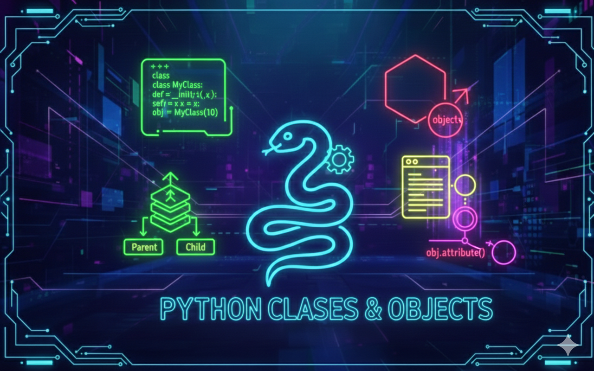

# More Classes and Objects

## Description
This project is a progressive deep dive into **Object-Oriented Programming (OOP) in Python**, built around a single core concept: the `Rectangle` class.

Starting from an empty shell, the rectangle evolves step by step:
- it gains private attributes,
- validation through properties,
- behavior via instance, class, and static methods,
- meaningful string representations,
- lifecycle tracking,
- and finally, advanced object comparison and construction.

Behind the scenes, this project is less about rectangles and more about **understanding how Python handles objects, attributes, and classes** — the Pythonic way.

---

## Learning Objectives
With this project, I learned how Object-Oriented Programming works in Python by building a `Rectangle` class that slowly became smarter than it looks. Along the way, I understood the difference between a class and an instance, how objects are created, and how Python stores and manages attributes behind the scenes.

I learned how to use `self`, revied `__init__`,  and how private attributes and properties help keep data clean and under control (because chaos is not a design pattern). This project also taught me how objects define their own behavior using special methods like `__str__`, `__repr__`, and `__del__`, making them readable, reproducible, and capable of saying goodbye properly.

By working with class attributes, class methods, and static methods, I discovered when logic belongs to the class itself rather than to individual instances. Finally, exploring `__dict__` helped me understand how Python finds attributes and glues everything together internally.

In the end, this project gave me a solid understanding of Python’s object model and how to write clean, maintainable OOP code — all thanks to a rectangle that did way more than just exist.

---

## Requirements
- OS: Ubuntu 20.04 LTS
- Python version: `python3` (3.8.5)
- All files must end with a new line
- The first line of all files must be exactly: `#!/usr/bin/python3`
- A README.md file at the root of the project is mandatory
- Code must follow pycodestyle (version 2.7.*)
- All files must be executable
- No module imports allowed unless explicitly stated

---

## Usage / Execution
All Python scripts can be executed in two ways:

### 1. Direct execution
Make the file executable and run it directly:
```bash
chmod +x filename.py
./filename.py
```

### 2. Using Python interpreter
Run the script with Python:
```bash
python3 filename.py
```

---

## Project Progress
<p align="center">

</p>

<p align="center">
<sub>Mandatory tasks completion: 100% ---  Advanced tasks completion: ---%</sub>
</p>

---

## Tasks

### Task 0 – Simple Rectangle
- **Status:** Completed
- **Objective:** Create the most minimal rectangle possible.
- **Constraint:** No imports allowed.
- **Expected behavior:** Define an empty `Rectangle` class that can be instantiated without errors.

**Files**
- `0-rectangle.py`

---

### Task 1 – Real Definition of a Rectangle
- **Status:** Completed
- **Objective:** Give the rectangle real dimensions.
- **Constraint:** Width and height must be integers and cannot be negative.
- **Expected behavior:** The rectangle stores private attributes and validates input using properties.

**Files**
- `1-rectangle.py`

---

### Task 2 – Area and Perimeter
- **Status:** Completed
- **Objective:** Teach the rectangle how to measure itself.
- **Constraint:** If width or height is zero, perimeter must be zero.
- **Expected behavior:** The rectangle can compute its area and perimeter accurately.

**Files**
- `2-rectangle.py`

---

### Task 3 – String Representation
- **Status:** Completed
- **Objective:** Make the rectangle printable.
- **Constraint:** Use the `#` character for display.
- **Expected behavior:** Printing the rectangle displays its shape, or an empty string if dimensions are zero.

**Files**
- `3-rectangle.py`

---

### Task 4 – Eval is Magic
- **Status:** Completed
- **Objective:** Allow the rectangle to recreate itself.
- **Constraint:** `repr()` must return a valid constructor string.
- **Expected behavior:** A new rectangle can be created using `eval(repr(rectangle))`.

**Files**
- `4-rectangle.py`

---

### Task 5 – Detect Instance Deletion
- **Status:** Completed
- **Objective:** Track when a rectangle is deleted.
- **Constraint:** Print a specific message upon deletion.
- **Expected behavior:** The message `Bye rectangle...` is displayed when an instance is destroyed.

**Files**
- `5-rectangle.py`

---

### Task 6 – How Many Instances
- **Status:** Completed
- **Objective:** Count how many rectangles exist at any time.
- **Constraint:** Use a class attribute to track instances.
- **Expected behavior:** The number of active rectangle instances updates correctly on creation and deletion.

**Files**
- `6-rectangle.py`

---

### Task 7 – Change Representation
- **Status:** Completed
- **Objective:** Customize how rectangles are displayed.
- **Constraint:** The print symbol can be any type.
- **Expected behavior:** The rectangle uses the class or instance `print_symbol` for its string representation.

**Files**
- `7-rectangle.py`

---

### Task 8 – Compare Rectangles
- **Status:** Completed
- **Objective:** Compare rectangles based on their area.
- **Constraint:** Both arguments must be instances of `Rectangle`.
- **Expected behavior:** The static method returns the biggest rectangle, or the first one if areas are equal.

**Files**
- `8-rectangle.py`

---

### Task 9 – A Square is a Rectangle
- **Status:** Completed
- **Objective:** Create a square using the rectangle class.
- **Constraint:** Width and height must be equal.
- **Expected behavior:** The class method returns a valid square-shaped rectangle.

**Files**
- `9-rectangle.py`


---

## Authors
**Gwenaelle PICHOT**
- Student at Holberton School
- Track: Higher Level Programming
- Project: More Classes and Objects