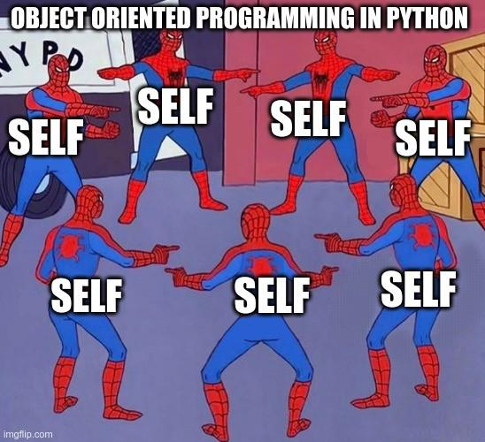

<p align="center">
  
</p>

# Python - More Classes and Objects

> Rectangles, class attributes, static methods, and the N Queens problem — OOP is getting serious.

---

## 📝 Description

This project deepens my understanding of Object-Oriented Programming by building a full-featured `Rectangle` class from the ground up, task by task. I explore class attributes vs instance attributes, static methods, class methods, `__str__` vs `__repr__`, instance deletion callbacks, and even a customizable print symbol. The grand finale is the N Queens puzzle — a classic backtracking algorithm that has nothing to do with rectangles but everything to do with problem-solving confidence.

---

## 🎯 Learning Objectives

By the end of this project, I am able to explain the full OOP landscape in Python: classes, objects, instances, attributes, methods, `self`, `__init__`, and the principles of Data Abstraction, Encapsulation, and Information Hiding. I understand the difference between `__str__` and `__repr__`, and I know when to use each. I can create and use class attributes, class methods, and static methods. I understand how Python resolves attributes through `__dict__` and the attribute lookup chain, and I know how to use `getattr` effectively.

---

## 🛠️ Technologies Used

This project is written entirely in Python 3 (version 3.8.5), running on Ubuntu 20.04 LTS. The N Queens task uses the `sys` module only. No other external modules are used. Code style is enforced with pycodestyle 2.7.*.

---

## ⚙️ Requirements

- OS: Ubuntu 20.04 LTS
- Python version: `python3` (3.8.5)
- All files must end with a new line
- The first line of all files must be exactly: `#!/usr/bin/python3`
- A README.md file at the root of the project is mandatory
- Code must follow pycodestyle (version 2.7.*)
- All files must be executable
- No module imports allowed unless explicitly stated

---

## 🚀 Installation

```bash
git clone https://github.com/GwenP88/holbertonschool-higher_level_programming.git
cd holbertonschool-higher_level_programming/python-more_classes
```

---

## ▶️ Usage / Execution

### Scripts and classes:
```bash
chmod +x filename.py
./filename.py
```

### N Queens:
```bash
./101-nqueens.py N
```
Where `N` is an integer ≥ 4.

---

## 📊 Project Progress

<p align="center">

</p>

<p align="center">
<sub>Mandatory tasks completion: 100% --- Advanced tasks completion: 0%</sub>
</p>

---

## ✨ Features

### Task 0 - Simple rectangle

- Mandatory
- Define an empty class `Rectangle` with no attributes or methods
- No imports
- Creates a valid, empty `Rectangle` object with an empty `__dict__`

**Files:** `0-rectangle.py`

---

### Task 1 - Real definition of a rectangle

- Mandatory
- Add private `width` and `height` attributes with properties and setters; both must be non-negative integers
- No imports; validation raises `TypeError` or `ValueError` with descriptive messages
- Accessible and updatable via property getters/setters from outside the class

**Files:** `1-rectangle.py`

---

### Task 2 - Area and Perimeter

- Mandatory
- Add `area()` and `perimeter()` public instance methods; perimeter is `0` if either dimension is `0`
- No imports
- Returns correct integer area and perimeter for any valid rectangle

**Files:** `2-rectangle.py`

---

### Task 3 - String representation

- Mandatory
- Implement `__str__` to print the rectangle using `#` characters; returns an empty string if either dimension is `0`
- No imports; `repr()` still returns the default object representation
- `print(rectangle)` and `str(rectangle)` output a visual `#` grid

**Files:** `3-rectangle.py`

---

### Task 4 - Eval is magic

- Mandatory
- Implement `__repr__` to return `Rectangle(width, height)` — a string that can recreate the instance via `eval()`
- No imports; `__str__` and `__repr__` serve different purposes and are both defined
- `eval(repr(rectangle))` creates a new, identical `Rectangle` instance

**Files:** `4-rectangle.py`

---

### Task 5 - Detect instance deletion

- Mandatory
- Implement `__del__` to print `Bye rectangle...` when an instance is deleted
- No imports
- Deletion of any `Rectangle` instance triggers the farewell message

**Files:** `5-rectangle.py`

---

### Task 6 - How many instances

- Mandatory
- Add a public class attribute `number_of_instances` initialized to `0`; incremented at creation, decremented at deletion
- No imports; tracks the live count of `Rectangle` instances across the program
- `Rectangle.number_of_instances` always reflects the current number of active instances

**Files:** `6-rectangle.py`

---

### Task 7 - Change representation

- Mandatory
- Add a public class attribute `print_symbol` (default `#`) used by `__str__`; can be any type, changed per instance or per class
- No imports; `str(row_of_symbol * width)` for each row
- The rectangle can be printed with any symbol or even a list as its character

**Files:** `7-rectangle.py`

---

### Task 8 - Compare rectangles

- Mandatory
- Add a static method `bigger_or_equal(rect_1, rect_2)` that returns the rectangle with the larger area; returns `rect_1` for ties
- No imports; raises `TypeError` if either argument is not a `Rectangle` instance
- Works as a class utility without needing an instance to call it

**Files:** `8-rectangle.py`

---

### Task 9 - A square is a rectangle

- Mandatory
- Add a class method `square(cls, size=0)` that returns a new `Rectangle` with `width == height == size`
- No imports; demonstrates how a class method can act as an alternative constructor
- `Rectangle.square(5)` returns a proper 5×5 rectangle

**Files:** `9-rectangle.py`

---

### Task 10 - Class and instance attributes

- Advanced - **This task is still in progress — my future self is on it.**
- Write a blog post explaining class vs instance attributes, creation methods, differences, trade-offs, and how Python handles them through `__dict__`
- Must include examples and at least one image; published on Medium or LinkedIn and shared
- A clear, illustrated explanation of one of OOP's most misunderstood distinctions

**Files:** *(blog post link — see repository)*

---

### Task 11 - N Queens

- Advanced - **This task is still in progress — my future self is on it.**
- Write a program `101-nqueens.py` that solves the N Queens puzzle for any N ≥ 4 using backtracking
- Only `sys` import allowed; validates arguments and exits with status 1 for invalid input; prints all solutions
- Prints every valid queen placement as a list of `[row, col]` pairs, one solution per line

**Files:** `101-nqueens.py`

---

## 🔮 What’s Next

I plan to continue working on this project by completing the advanced tasks that are not done yet. This will allow me to deepen my understanding, improve my skills, and push a bit further beyond the basics (because stopping halfway is not really my style).

---

## 🤝 Contributions & Acknowledgements

Thanks to everyone who survived the N Queens task alongside me. Backtracking on a whiteboard at 11pm builds character — and also a very healthy respect for recursion.

---

## 👤 Author

**Gwenaelle PICHOT**
- Student at Holberton School
- Track: holbertonschool-higher_level_programming
- Project: python-more_classes