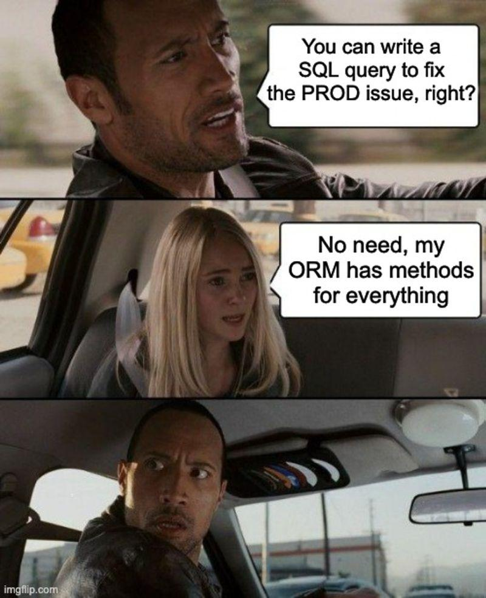

<p align="center">
  
</p>

# Python - Object-Relational Mapping

> Bridging Python and MySQL — because raw SQL strings are so last decade.

---

## 📝 Description

This project introduces me to two powerful ways of interacting with a MySQL database from Python: the low-level `MySQLdb` module and the elegant SQLAlchemy ORM. I start by writing raw SQL queries in Python scripts, quickly learn why SQL injection is terrifying, and then graduate to mapping Python classes directly to database tables. By the end, I can create, read, update, and delete database records without writing a single raw SQL string — just clean, Pythonic object manipulation.

---

## 🎯 Learning Objectives

By the end of this project, I am able to connect to a MySQL database from a Python script, execute SELECT and INSERT queries using `MySQLdb`, and protect against SQL injection using parameterized queries. I understand what ORM means and how SQLAlchemy maps Python classes to MySQL tables. I can use SQLAlchemy sessions to query, insert, update, and delete records, and I know how to define relationships between models using foreign keys and `relationship()`.

---

## 🛠️ Technologies Used

This project is written in Python 3 (version 3.8.5), running on Ubuntu 20.04 LTS. It uses MySQL 8.0 as the database backend, `MySQLdb` version 2.0.x for direct SQL queries, and `SQLAlchemy` version 1.4.x for ORM-based interactions. The `execute` method is not allowed with SQLAlchemy — only ORM queries are used. Code style is enforced with pycodestyle 2.7.*.

---

## ⚙️ Requirements

- OS: Ubuntu 20.04 LTS
- Python version: `python3` (3.8.5)
- MySQL version: 8.0
- MySQLdb version: 2.0.x
- SQLAlchemy version: 1.4.x
- All files must end with a new line
- The first line of all files must be exactly: `#!/usr/bin/python3`
- A README.md file at the root of the project is mandatory
- Code must follow pycodestyle (version 2.7.*)
- All files must be executable
- All modules, classes, and functions must have meaningful docstrings
- `execute` is not allowed with SQLAlchemy

---

## 🚀 Installation

```bash
# Install MySQL
sudo apt update && sudo apt install mysql-server

# Install MySQLdb
sudo apt-get install python3-dev libmysqlclient-dev zlib1g-dev
sudo pip3 install mysqlclient==2.0.3

# Install SQLAlchemy
sudo pip3 install SQLAlchemy==1.4.22

# Clone the repository
git clone https://github.com/GwenP88/holbertonschool-higher_level_programming.git
cd holbertonschool-higher_level_programming/python-object_relational_mapping
```

---

## ▶️ Usage / Execution

All scripts take MySQL credentials as arguments:

```bash
chmod +x script.py
./script.py <mysql_username> <mysql_password> <database_name>
# For scripts requiring an additional argument (state name, etc.):
./script.py <mysql_username> <mysql_password> <database_name> <argument>
```

---

## 📊 Project Progress

<p align="center">

</p>

<p align="center">
<sub>Mandatory tasks completion: 100% --- Advanced tasks completion: 0%</sub>
</p>

---

## ✨ Features

### Task 0 - Get all states

- Mandatory
- List all states from `hbtn_0e_0_usa` using `MySQLdb`; takes 3 arguments (username, password, database)
- Connects to localhost:3306; results sorted ascending by `states.id`; code must not run on import
- Prints all state rows as tuples in ascending order by ID

**Files:** `0-select_states.py`

---

### Task 1 - Filter states

- Mandatory
- List all states whose name starts with `N` (uppercase) using `MySQLdb`
- Same connection requirements; sorted by `states.id`
- Prints only states whose name begins with the letter N

**Files:** `1-filter_states.py`

---

### Task 2 - Filter states by user input

- Mandatory
- Display all states matching a user-supplied name argument using `MySQLdb` and `str.format()`
- Takes 4 arguments; sorted by `states.id`; intentionally not injection-safe (contrast with Task 3)
- Prints matching states based on the exact name provided

**Files:** `2-my_filter_states.py`

---

### Task 3 - SQL Injection... safe edition

- Mandatory
- Rewrite Task 2 using parameterized queries to prevent SQL injection attacks
- Uses `MySQLdb` with parameterized cursor execution; takes 4 arguments; safe from injection
- Immune to payloads like `'; TRUNCATE TABLE states ; --` — the data is safe

**Files:** `3-my_safe_filter_states.py`

---

### Task 4 - Cities by states

- Mandatory
- List all cities with their corresponding state names from `hbtn_0e_4_usa` using a single `execute()` call and a JOIN
- Results sorted ascending by `cities.id`
- Prints tuples of `(city_id, city_name, state_name)` in ascending city ID order

**Files:** `4-cities_by_state.py`

---

### Task 5 - All cities by state

- Mandatory
- List all cities belonging to a given state name using `MySQLdb`; SQL injection-safe; single `execute()` call
- Takes 4 arguments; results sorted ascending by `cities.id`
- Prints a comma-separated list of city names for the given state, or nothing if not found

**Files:** `5-filter_cities.py`

---

### Task 6 - First state model

- Mandatory
- Write `model_state.py` containing the `State` class and `Base = declarative_base()`; maps to the `states` MySQL table
- Uses `Column`, `Integer`, `String`; `id` is auto-generated primary key; `name` max 128 chars, not null
- Running the companion script creates the `states` table if it doesn't exist

**Files:** `model_state.py`

---

### Task 7 - All states via SQLAlchemy

- Mandatory
- List all `State` objects from `hbtn_0e_6_usa` using a SQLAlchemy session query; sorted by `states.id`
- Uses `from model_state import Base, State`; no raw `execute()`
- Prints each state as `<id>: <name>` in ascending ID order

**Files:** `7-model_state_fetch_all.py`

---

### Task 8 - First state

- Mandatory
- Print the first `State` object (lowest `states.id`) using SQLAlchemy; print `Nothing` if the table is empty
- Must not fetch all states before displaying; uses `first()` or equivalent
- Prints `<id>: <name>` of the state with the lowest ID

**Files:** `8-model_state_fetch_first.py`

---

### Task 9 - Contains `a`

- Mandatory
- List all `State` objects whose name contains the letter `a` using SQLAlchemy ORM filtering; sorted by `states.id`
- No raw SQL
- Prints all matching states as `<id>: <name>`

**Files:** `9-model_state_filter_a.py`

---

### Task 10 - Get a state

- Mandatory
- Print the ID of the `State` whose name matches the argument; print `Not found` if no match; SQL injection-safe
- Takes 4 arguments; uses SQLAlchemy ORM filtering
- Prints the `states.id` of the matching state, or `Not found`

**Files:** `10-model_state_my_get.py`

---

### Task 11 - Add a new state

- Mandatory
- Add the `State` object "Louisiana" to `hbtn_0e_6_usa` using SQLAlchemy; print the new state's ID after creation
- Uses session `add()` and `commit()`
- Prints the auto-generated ID of the newly inserted state

**Files:** `11-model_state_insert.py`

---

### Task 12 - Update a state

- Mandatory
- Change the name of the `State` with `id = 2` to "New Mexico" using SQLAlchemy
- Uses session query and attribute update with `commit()`
- The state at ID 2 is renamed in the database

**Files:** `12-model_state_update_id_2.py`

---

### Task 13 - Delete states

- Mandatory
- Delete all `State` objects whose name contains the letter `a` using SQLAlchemy ORM
- Uses ORM filtering and session `delete()` with `commit()`
- All states with `a` in their name are permanently removed from the database

**Files:** `13-model_state_delete_a.py`

---

### Task 14 - Cities in state

- Mandatory
- Write `model_city.py` defining the `City` class (linked to `cities` table with FK to `states`); write a script that prints all cities with their state name
- `City` has `id`, `name`, and `state_id` (FK to `states.id`); sorted by `cities.id`
- Prints `<state name>: (<city id>) <city name>` for all cities

**Files:** `model_city.py`, `14-model_city_fetch_by_state.py`

---

### Task 15 - City relationship

- Advanced - **This task is still in progress — my future self is on it.**
- Extend `State` and `City` models with a `cities` relationship using `relationship()` and cascade delete; write a script creating "California" with "San Francisco"
- Deleting a `State` automatically deletes all its linked `City` objects; `City` objects have a back-reference `state`
- Demonstrates ORM-level cascading and relationship navigation between models

**Files:** `relationship_city.py`, `relationship_state.py`, `100-relationship_states_cities.py`

---

### Task 16 - List relationship

- Advanced - **This task is still in progress — my future self is on it.**
- List all `State` objects and their linked `City` objects using the `cities` relationship; single query; sorted by `states.id` and `cities.id`
- Uses the ORM relationship to avoid a second query; hierarchical display
- Prints `<state id>: <state name>` then `\t<city id>: <city name>` for each city

**Files:** `101-relationship_states_cities_list.py`

---

### Task 17 - From city

- Advanced - **This task is still in progress — my future self is on it.**
- List all `City` objects with their linked state name using the `state` back-reference; single query; sorted by `cities.id`
- No raw SQL; uses the `state` relationship on `City`
- Prints `<city id>: <city name> -> <state name>` for all cities

**Files:** `102-relationship_cities_states_list.py`

---

## 🔮 What’s Next

I plan to continue working on this project by completing the advanced tasks that are not done yet. This will allow me to deepen my understanding, improve my skills, and push a bit further beyond the basics (because stopping halfway is not really my style).

---

## 🤝 Contributions & Acknowledgements

Thanks to Holberton School for the SQL injection demo — nothing makes parameterized queries feel more necessary than watching your entire table silently disappear. Lesson learned, permanently.

---

## 👤 Author

**Gwenaelle PICHOT**
- Student at Holberton School
- Track: holbertonschool-higher_level_programming
- Project: python-object_relational_mapping