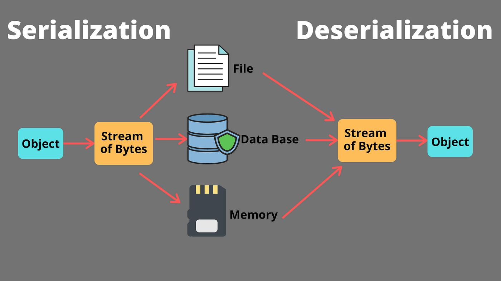

<p align="center">
  
</p>

# Python - Serialization

> From Python objects to JSON, pickle, CSV, XML, and even across a network — data finds a way.

---

## 📝 Description

This project explores the fascinating world of marshaling and serialization in Python. I learn how to transform Python objects into formats that can be stored, transmitted, and reconstructed — using JSON, pickle, CSV, XML, and even raw socket communication. By working through each format, I develop a clear understanding of when and why each serialization method is the right tool for the job, and how data persistence and transmission work in real-world applications.

---

## 🎯 Learning Objectives

By the end of this project, I am able to explain the differences and similarities between marshaling and serialization. I can implement serialization in practical scenarios using JSON, pickle, CSV, and XML. I understand how serialized data is used in web applications, databases, and network communications, and I can evaluate the performance implications and trade-offs of different serialization formats.

---

## 🛠️ Technologies Used

This project is written in Python 3 (version 3.8.5), running on Ubuntu 20.04 LTS. It makes use of the following standard library modules: `json`, `pickle`, `csv`, `xml.etree.ElementTree`, and `socket`. No third-party libraries are required. Code style is enforced with pycodestyle 2.7.*.

---

## ⚙️ Requirements

- OS: Ubuntu 20.04 LTS
- Python version: `python3` (3.8.5)
- All files must end with a new line
- The first line of all files must be exactly: `#!/usr/bin/env python3`
- A README.md file at the root of the project is mandatory
- Code must follow pycodestyle (version 2.7.*)
- All files must be executable
- Module imports are allowed as needed per task

---

## 🚀 Installation

```bash
git clone https://github.com/GwenP88/holbertonschool-higher_level_programming.git
cd holbertonschool-higher_level_programming/python-serialization
```

---

## ▶️ Usage / Execution

All Python scripts can be executed in two ways:

### 1. Direct execution
```bash
chmod +x main_XX_taskname.py
./main_XX_taskname.py
```

### 2. Using Python interpreter
```bash
python3 main_XX_taskname.py
```

### For the client-server task (Task 4):
```bash
python3 main_04_net.py
```
The server runs in a separate thread; client sends data automatically.

---

## 📊 Project Progress

<p align="center">

</p>

<p align="center">
<sub>Mandatory tasks completion: 100% --- Advanced tasks completion: 0%</sub>
</p>

---

## ✨ Features

### Task 0 - Basic Serialization

- Mandatory
- Write a module with two functions: `serialize_and_save_to_file(data, filename)` that serializes a Python dictionary to a JSON file, and `load_and_deserialize(filename)` that reads and returns the deserialized dictionary from a JSON file
- If the output file already exists, it is overwritten; uses the `json` module
- Round-trips a Python dictionary to disk and back without any data loss

**Files:** `task_00_basic_serialization.py`

---

### Task 1 - Pickling Custom Classes

- Mandatory
- Create a `CustomObject` class with `name`, `age`, and `is_student` attributes; add a `display()` method to print them; implement `serialize(filename)` and `deserialize(filename)` methods using the `pickle` module
- Handles file-not-found and malformed file exceptions gracefully; returns `None` on failure
- Saves and reconstructs a custom Python object from a `.pkl` binary file with full fidelity

**Files:** `task_01_pickle.py`

---

### Task 2 - Converting CSV Data to JSON Format

- Mandatory
- Write a function `convert_csv_to_json(csv_filename)` that reads a CSV file using `csv.DictReader`, converts each row to a dictionary, serializes the list to JSON, and writes it to `data.json`
- Returns `True` on success, `False` if the CSV file is not found; uses `csv` and `json` modules
- Produces a valid `data.json` file from any properly formatted CSV input

**Files:** `task_02_csv.py`

---

### Task 3 - Serializing and Deserializing with XML

- Mandatory
- Write two functions: `serialize_to_xml(dictionary, filename)` that converts a Python dictionary to XML and saves it, and `deserialize_from_xml(filename)` that parses an XML file and returns the reconstructed dictionary
- Uses `xml.etree.ElementTree`; handles type management carefully since XML stores everything as strings
- Produces a clean XML file from a dictionary and reconstructs the exact dictionary from the XML

**Files:** `task_03_xml.py`

---

### Task 4 - Client-Server Application with Serialization

- Advanced - **This task is still in progress — my future self is on it.**
- Build a client-server application using Python sockets; the client serializes a Python dictionary to JSON and sends it over a network connection; the server receives, deserializes, and prints the data
- Uses `socket` and `json` modules; handles connection exceptions; client and server are defined as `send_data` and `start_server` functions
- Demonstrates end-to-end serialization in a real network communication scenario with a server running in a thread

**Files:** `task_04_net.py`

---

## 🔮 What’s Next

I plan to continue working on this project by completing the advanced tasks that are not done yet. This will allow me to deepen my understanding, improve my skills, and push a bit further beyond the basics (because stopping halfway is not really my style).

---

## 🤝 Contributions & Acknowledgements

Thanks to Holberton School for this project, which genuinely made me appreciate how much work happens between "save" and "load" in any real application. Sockets and XML were humbling in the best possible way.

---

## 👤 Author

**Gwenaelle PICHOT**
- Student at Holberton School
- Track: holbertonschool-higher_level_programming
- Project: python-serialization