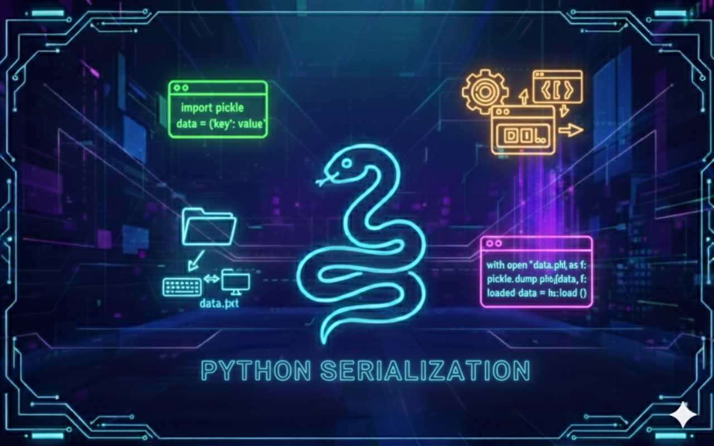

# Python - Serialization

## Description
This project explores marshaling and serialization, two essential concepts in computer science that allow data to be stored, transmitted, and reconstructed efficiently. 
Through a series of practical tasks, the project demonstrates how Python objects can be transformed into structured formats such as JSON, Pickle, and XML, and then restored to their original state.

The project focuses on real-world use cases such as file persistence, data exchange between systems, and object reconstruction. 
By implementing multiple serialization techniques, it provides a solid understanding of how structured data flows between applications, files, and networks.

---

## Learning Objectives
Through this project, I learned to clearly distinguish between marshaling and serialization and to understand how they are used in practical software development scenarios. 
I learned how to serialize Python dictionaries into JSON format and restore them back into usable Python objects.
I gained hands-on experience working with the pickle module to serialize and deserialize custom Python classes while handling potential errors safely.
I also learned how to convert data between different structured formats such as CSV, JSON, and XML, and understood the implications of format choice in terms of structure, readability, and data type management.

---

## Requirements
- OS: Ubuntu 20.04 LTS
- Python version: `python3` (3.8.5)
- All files must end with a new line
- The first line of all files must be exactly: `#!/usr/bin/python3`
- A README.md file at the root of the project is mandatory
- Code must follow pycodestyle (version 2.7.*)
- All files must be executable
- No module imports allowed unless explicitly stated

---

## Usage / Execution
All Python scripts can be executed in two ways:

### 1. Direct execution
Make the file executable and run it directly:
```bash
chmod +x filename.py
./filename.py
```

### 2. Using Python interpreter
Run the script with Python:
```bash
python3 filename.py
```

---

## Project Progress
<p align="center">

</p>

<p align="center">
<sub>Mandatory tasks completion: 100% ---  Advanced tasks completion: %</sub>
</p>

---

## Tasks
### Task 0 - Basic Serialization

- **Task status**  
Completed

- **Task objectives**  
Implement a Python module capable of serializing a dictionary into a JSON file and deserializing JSON data back into a Python dictionary.

- **Task constraint**  
The module must define two functions: `serialize_and_save_to_file(data, filename)` and `load_and_deserialize(filename)`. The output file must be overwritten if it already exists. Only standard Python libraries may be used.

- **Expected behavior**  
The function must correctly write dictionary data into a JSON file and reconstruct the exact dictionary structure when loading the file. The deserialized output must match the original input data.

**Files:**  
`task_00_basic_serialization.py`

---

### Task 1 - Pickling Custom Classes

- **Task status**  
Completed

- **Task objectives**  
Create a custom Python class and implement serialization and deserialization of class instances using the pickle module.

- **Task constraint**  
The class must include attributes (`name`, `age`, `is_student`) and methods `serialize(self, filename)` and `@classmethod deserialize(cls, filename)`. Exception handling must be implemented to return `None` if the file does not exist or is malformed.

- **Expected behavior**  
An instance of the custom class must be saved to a `.pkl` file and correctly restored as a new object instance with identical attribute values. The `display` method must output formatted attribute information.

**Files:**  
`task_01_pickle.py`

---

### Task 2 - Converting CSV Data to JSON Format

- **Task status**  
Completed

- **Task objectives**  
Read structured data from a CSV file and convert it into JSON format using serialization techniques.

- **Task constraint**  
Use `csv.DictReader` to read the CSV content and the `json` module to serialize the data. The function must return `True` if successful and `False` if an exception occurs.

- **Expected behavior**  
The CSV data must be transformed into a list of dictionaries and written into `data.json` in valid JSON format. The resulting JSON structure must accurately reflect the original CSV rows.

**Files:**  
`task_02_csv.py`

---

### Task 3 - Serializing and Deserializing with XML

- **Task status**  
Completed

- **Task objectives**  
Implement serialization and deserialization of a Python dictionary using XML format.

- **Task constraint**  
Use `xml.etree.ElementTree` from Python’s standard library. 
The module must define two functions: `serialize_to_xml(dictionary, filename)` and `deserialize_from_xml(filename)`. 
Care must be taken when handling data types, as XML stores values as text.

- **Expected behavior**  
The dictionary must be converted into a structured XML file with a root element and child elements for each key-value pair. 
The deserialization function must correctly parse the XML file and reconstruct the dictionary.

**Files:**  
`task_03_xml.py`

---

## Authors
**Gwenaelle PICHOT**
- Student at Holberton School
- Track: Higher Level Programming
- Project: Python - Serialization