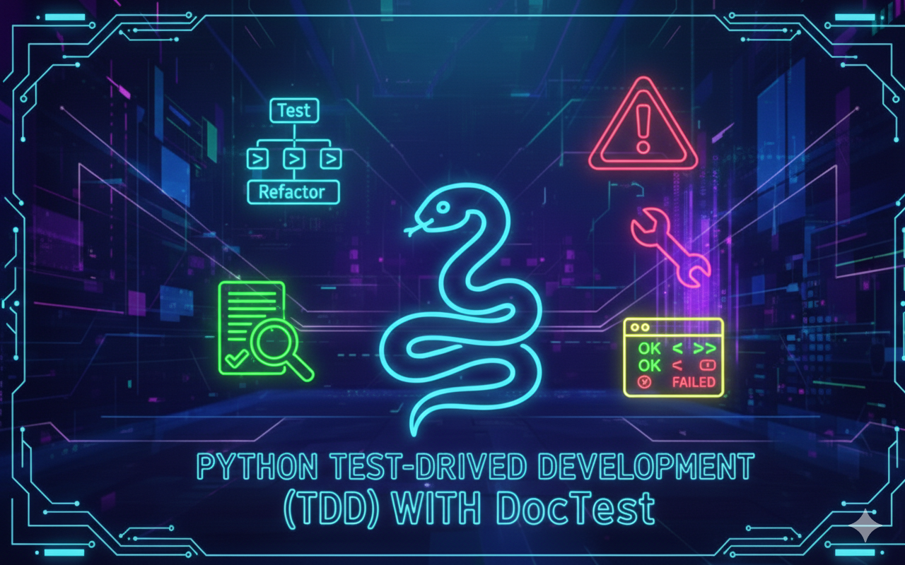

# Python – Test-Driven Development

## Description

This project introduces **Test-Driven Development (TDD)** using Python.  
The main idea is to **write tests and documentation before writing the actual code**, in order to think carefully about expected behaviors, edge cases, and error handling.

You will practice:
- Writing **doctests** inside documentation
- Writing **unittests** using the `unittest` module
- Designing functions by thinking about **all possible edge cases**
- Writing clear and complete **module and function docstrings**

---

## Learning Objectives

Through this project, I learned that testing is not optional—it’s the safety net that prevents my code from embarrassing me later. 
Writing tests first forced me to clearly define what a function should do before letting it do anything at all.

Using docstrings with doctest showed me that documentation can do more than look pretty: it can actively catch mistakes. 
I also learned to hunt down edge cases, because users have a special talent for doing things the code was never meant to handle.

In the end, this project taught me that tests don’t slow development down—they save time, protect sanity, and keep bugs from throwing surprise parties in production.

---

## Requirements

### Python Scripts
- Allowed editors: `vi`, `vim`, `emacs`
- Python version: **Python 3.8.5** (Ubuntu 20.04 LTS)
- All files must end with a new line
- First line of each file must be:  `#!/usr/bin/python3`
- Code must follow pycodestyle (version 2.7.*)
- All files must be executable
- File length will be checked using wc
- A README.md file is mandatory

---
 
### Python Test Cases

- Test files must be inside the tests/ directory
- Doctest files must be .txt
- Doctests are executed using: `python3 -m doctest ./tests/*`
- Unit tests are executed using: `python3 -m unittest tests.6-max_integer_test`
- All modules and functions must have real documentation sentences
- The checker verifies the presence and quality of tests

---

## Tasks Overview

### 0. Integers Addition
- Adds two integers
- Handles floats by casting them to integers
- Raises appropriate `TypeError` exceptions
- Uses doctests for validation

### 1. Divide a Matrix
- Divides all elements of a matrix
- Validates the matrix structure and the divisor
- Returns a new matrix with values rounded to 2 decimal places

### 2. Say My Name
- Prints a formatted full name
- Validates that inputs are strings

### 3. Print Square
- Prints a square using the `#` character
- Handles size validation and related errors

### 4. Text Indentation
- Prints text with two new lines after `.`, `?`, and `:`
- Removes extra spaces at the beginning and end of lines
- Validates input type

### 5. Max Integer – Unittest
- Writes unittests for the `max_integer` function
- Covers edge cases (empty list, negative numbers, etc.)
- Uses the `unittest` module

---

## Testing Commands Summary

Run doctests: `python3 -m doctest ./tests/*`
Run unit tests: `python3 -m unittest tests.6-max_integer_test`

---

## Key Takeaway

Think before you code. Test before you trust.

This project focuses on building strong habits:
- anticipating errors.
- validating inputs.
- writing reliable, maintainable code through testing.

---

## Author

**Gwenaelle PICHOT**  
Student at Holberton School  
Track: Higher Level Programming  
Project: Python -Test-Driven development

