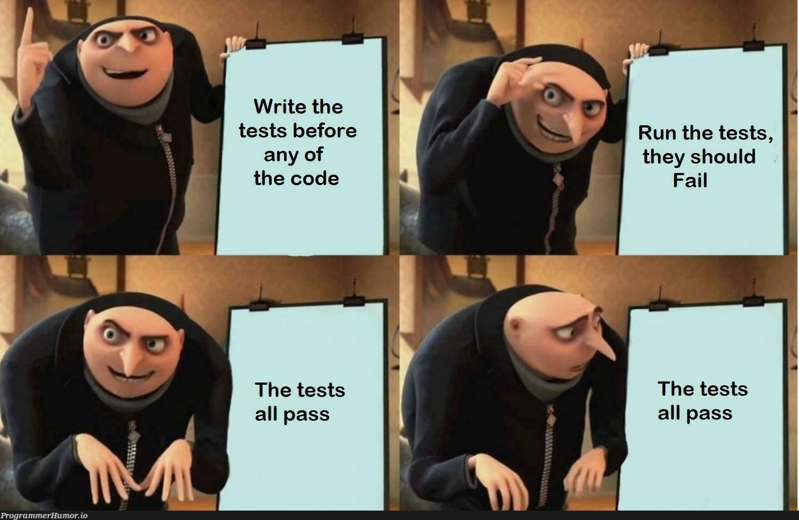

<p align="center">
  
</p>

# Python - Test-driven Development

> Write the test first, then write the code — it's not backwards, it's brilliant.

---

## 📝 Description

This project introduces me to the philosophy and practice of Test-Driven Development (TDD) in Python. Instead of writing code and hoping for the best, I learn to think about edge cases before writing a single line of implementation. I write doctests and unittests to validate my functions, document every module and function properly, and discover that the real bugs are the friends we made along the way — mostly in the edge cases I forgot to consider.

---

## 🎯 Learning Objectives

By the end of this project, I am able to explain what interactive tests are and why testing is a fundamental part of software development. I know how to write Docstrings that double as test cases using the `doctest` module, and I can document every module and function clearly and meaningfully. I understand the basic option flags used to create and run tests, and I am able to identify edge cases systematically to make my test suites robust and complete.

---

## 🛠️ Technologies Used

This project is written in Python 3 (version 3.8.5), running on Ubuntu 20.04 LTS. I use the built-in `doctest` module for interactive test cases stored in `.txt` files, and the `unittest` module for more structured unit tests. One advanced task uses NumPy (`numpy==1.15.0`) for matrix multiplication. Code style is enforced with pycodestyle 2.7.*.

---

## ⚙️ Requirements

**Python Scripts**
- OS: Ubuntu 20.04 LTS
- Python version: `python3` (3.8.5)
- All files must end with a new line
- The first line of all files must be exactly: `#!/usr/bin/python3`
- A README.md file at the root of the project is mandatory
- Code must follow pycodestyle (version 2.7.*)
- All files must be executable

**Python Test Cases**
- All test files must be inside a `tests/` folder
- Doctest files must use the `.txt` extension
- Unittest files must use the `.py` extension
- All doctests are executed with: `python3 -m doctest ./tests/*`
- All modules must have documentation
- All functions must have documentation (real sentences, not just a word)
- Unittest tests are run with: `python3 -m unittest tests.6-max_integer_test`

---

## 🚀 Installation

```bash
git clone https://github.com/GwenP88/holbertonschool-higher_level_programming.git
cd holbertonschool-higher_level_programming/python-test_driven_development
```

For the advanced task using NumPy:
```bash
pip3 install numpy==1.15.0
```

---

## ▶️ Usage / Execution

### Running doctest files
```bash
python3 -m doctest ./tests/filename.txt
python3 -m doctest -v ./tests/filename.txt  # verbose mode
```

### Running unittest files
```bash
python3 -m unittest tests.6-max_integer_test
```

### Running Python scripts directly
```bash
chmod +x filename.py
./filename.py
```

---

## 📊 Project Progress

<p align="center">

</p>

<p align="center">
<sub>Mandatory tasks completion: 100% --- Advanced tasks completion: 0%</sub>
</p>

---

## ✨ Features

### Task 0 - Integers addition

- Mandatory
- Write a function `add_integer(a, b=98)` that adds two integers or floats (cast to int); raises `TypeError` for invalid inputs; no imports
- Both `a` and `b` must be integers or floats; floats are cast to integers before addition
- Returns the integer sum of `a` and `b`

**Files:** `0-add_integer.py`, `tests/0-add_integer.txt`

---

### Task 1 - Divide a matrix

- Mandatory
- Write a function `matrix_divided(matrix, div)` that divides all elements of a matrix by `div`, rounded to 2 decimal places
- Validates matrix structure (list of lists, uniform row sizes, numeric values), `div` type and non-zero value; raises `TypeError` or `ZeroDivisionError` accordingly; no imports
- Returns a new matrix with each element divided by `div`

**Files:** `2-matrix_divided.py`, `tests/2-matrix_divided.txt`

---

### Task 2 - Say my name

- Mandatory
- Write a function `say_my_name(first_name, last_name="")` that prints `My name is <first name> <last name>`
- Both arguments must be strings; raises `TypeError` with descriptive messages if not; no imports
- Prints the formatted name string

**Files:** `3-say_my_name.py`, `tests/3-say_my_name.txt`

---

### Task 3 - Print square

- Mandatory
- Write a function `print_square(size)` that prints a square of `#` characters with side length `size`
- `size` must be a non-negative integer; raises `TypeError` or `ValueError` for invalid input; no imports
- Prints `size` rows of `size` `#` characters each

**Files:** `4-print_square.py`, `tests/4-print_square.txt`

---

### Task 4 - Text indentation

- Mandatory
- Write a function `text_indentation(text)` that prints text with two newlines after each `.`, `?`, or `:` character
- `text` must be a string; raises `TypeError` otherwise; no leading or trailing spaces on each line; no imports
- Prints the formatted text with appropriate line breaks

**Files:** `5-text_indentation.py`, `tests/5-text_indentation.txt`

---

### Task 5 - Max integer - Unittest

- Mandatory
- Write a full unittest suite for the `max_integer(list=[])` function using the `unittest` module
- Test file must be in `tests/`, use `.py` extension, cover all edge cases including empty lists, single elements, negative numbers, and mixed values
- All tests must pass against the provided `max_integer` implementation

**Files:** `tests/6-max_integer_test.py`

---

### Task 6 - Matrix multiplication

- Advanced - **This task is still in progress — my future self is on it.**
- Write a function `matrix_mul(m_a, m_b)` that multiplies two matrices manually
- Validates both matrices extensively (type, structure, content, compatibility for multiplication); raises `TypeError` or `ValueError` with precise messages; no imports
- Returns the resulting product matrix

**Files:** `100-matrix_mul.py`, `tests/100-matrix_mul.txt`

---

### Task 7 - Lazy matrix multiplication

- Advanced - **This task is still in progress — my future self is on it.**
- Write a function `lazy_matrix_mul(m_a, m_b)` that multiplies two matrices using NumPy (`numpy.matmul`)
- Requires `numpy==1.15.0`; test cases mirror those of Task 6 but exception types and messages may differ
- Returns the NumPy result of the matrix multiplication

**Files:** `101-lazy_matrix_mul.py`, `tests/101-lazy_matrix_mul.txt`

---

## 🔮 What’s Next

I plan to continue working on this project by completing the advanced tasks that are not done yet. This will allow me to deepen my understanding, improve my skills, and push a bit further beyond the basics (because stopping halfway is not really my style).

---

## 🤝 Contributions & Acknowledgements

Big thanks to the Holberton School community for encouraging collaborative test writing — because covering edge cases alone is honestly a little sad. Two brains find more bugs than one, and that's just math.

---

## 👤 Author

**Gwenaelle PICHOT**
- Student at Holberton School
- Track: holbertonschool-higher_level_programming
- Project: python-test_driven_development